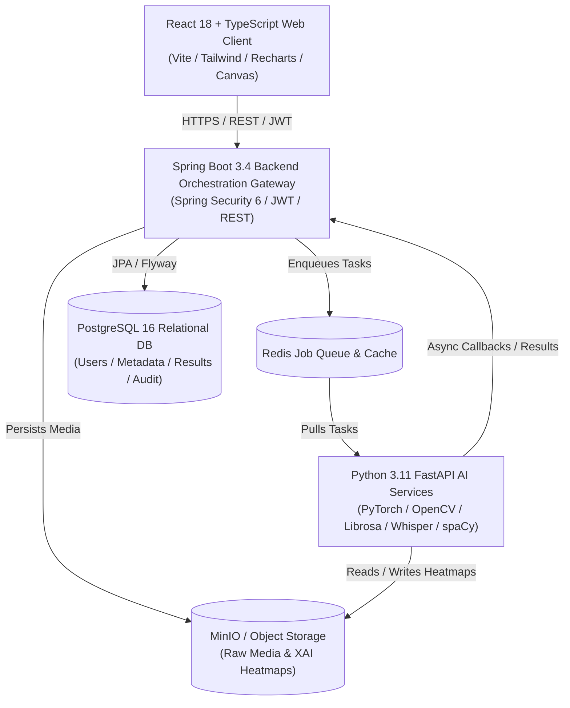
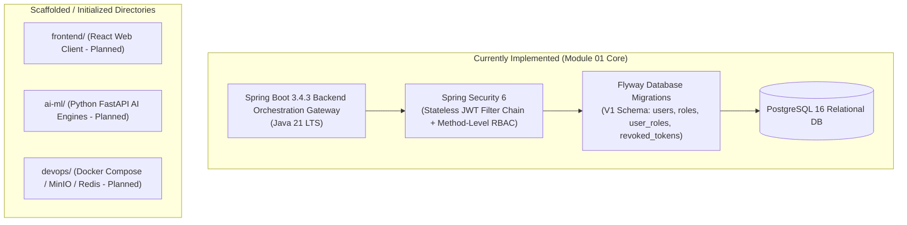

# Architecture Overview

This document provides a high-level overview of the **TruthLens Authenticity Platform** architecture, contrasting the full blueprint target architecture with the current repository implementation state.

---

## 1. Architectural Vision (Blueprint vs. Current State)

The authoritative architecture for TruthLens is defined in [TruthLensBlueprint.html](file:///c:/Users/Yashas%20H%20L/IdeaProjects/TruthLens/TruthLens-Authenticity-Platform/blueprint/TruthLensBlueprint.html). 

TruthLens is conceived as an intelligent, multi-tier authenticity platform designed to detect synthetic, manipulated, and deepfake multimedia across image, video, audio, and text modalities.

### Planned Topology (Blueprint)



### Current Implementation State



---

## 2. Technology Stack Classification

| Component | Blueprint Target | Current Implementation | Status |
| :--- | :--- | :--- | :--- |
| **Backend Core** | Java 21 LTS, Spring Boot 3.2+ | Java 21 LTS, Spring Boot 3.4.3 | **Implemented** |
| **Security & Auth** | Spring Security 6, JJWT, BCrypt | Spring Security 6, JJWT 0.12.6, BCrypt | **Implemented** |
| **Data Persistence** | Spring Data JPA, Hibernate, PostgreSQL 16 | Spring Data JPA, Hibernate 6, PostgreSQL 16/17 | **Implemented** |
| **Schema Migrations** | Flyway versioned migrations | Flyway Core 10+ with `flyway-database-postgresql` | **Implemented** |
| **Testing Framework** | JUnit 5, MockMvc, Spring Security Test | JUnit 5, Mockito, MockMvc, Spring Security Test | **Implemented** |
| **Web Client** | React 18, TypeScript, Vite, Tailwind CSS | Directory scaffolded (`frontend/`) | *Planned* |
| **AI / ML Services** | Python 3.11, FastAPI, PyTorch, OpenCV, Whisper | Directory scaffolded (`ai-ml/`) | *Planned* |
| **Queue & Cache** | Redis | Directory scaffolded (`devops/`) | *Planned* |
| **Object Storage** | MinIO / S3-compatible | Local file system / MinIO planned | *Planned* |

---

## 3. Backend Architecture & Component Layers

The active backend service (`backend/`) is structured following clean architectural boundaries:

```
backend/src/main/java/com/truthlens/backend/
├── TruthLensBackendApplication.java    # Spring Boot Entry Point
├── config/                             # Security & infrastructure configuration
│   ├── SecurityConfig.java             # Spring Security filter chain & route authorization
│   └── PasswordEncoderConfig.java      # BCrypt password hasher bean
├── controller/                         # REST API endpoint controllers
│   ├── AuthController.java             # /api/auth (register, login, logout)
│   ├── UserController.java             # /api/users (profile get/put)
│   └── RbacTestController.java         # /api/rbac (internal verification endpoints)
├── dto/                                # Data Transfer Objects (Inbound & Outbound)
│   ├── RegisterRequest.java
│   ├── LoginRequest.java
│   ├── AuthResponse.java
│   ├── LogoutResponse.java
│   ├── UserProfileResponse.java
│   ├── UpdateProfileRequest.java
│   └── ApiErrorResponse.java
├── entity/                             # JPA Persistence Entities
│   ├── User.java
│   ├── Role.java
│   ├── RoleName.java                   # Predefined enum: USER, ANALYST, MODERATOR, ADMIN, RESEARCHER
│   ├── AccountStatus.java              # Enum: ACTIVE, SUSPENDED, PENDING_VERIFICATION
│   └── RevokedToken.java
├── exception/                          # Custom domain exceptions & global handler
│   ├── GlobalExceptionHandler.java     # @RestControllerAdvice mapping exceptions to ApiErrorResponse
│   ├── EmailAlreadyExistsException.java
│   ├── InvalidCredentialsException.java
│   ├── AccountSuspendedException.java
│   ├── UserNotFoundException.java
│   └── RoleNotFoundException.java
├── repository/                         # Spring Data JPA repositories
│   ├── UserRepository.java
│   ├── RoleRepository.java
│   └── RevokedTokenRepository.java
├── security/                           # Authentication & token services
│   ├── JwtService.java                 # JJWT 0.12 HMAC-SHA256 generator & validator
│   └── JwtAuthenticationFilter.java    # OncePerRequestFilter with revocation checking
└── service/                            # Core business logic
    ├── AuthService.java                # Registration, login, revocation orchestration
    └── UserService.java                # Authenticated user profile retrieval & update
```

---

## 4. Core Security Model

1. **Stateless Authentication**:
   The backend does not maintain server-side HTTP sessions (`SessionCreationPolicy.STATELESS`). All authenticated requests transmit a cryptographic JWT Bearer token in the `Authorization` header.
2. **Cryptographic Tokens**:
   Tokens are signed using HMAC-SHA256 with a 256-bit secret key (`truthlens.jwt.secret`). Tokens carry subject email, user UUID, token identifier (`jti`), and roles formatted with the `ROLE_` prefix.
3. **Token Revocation (Logout)**:
   Upon logout (`POST /api/auth/logout`), the token's unique identifier (`jti`) is persisted in the `revoked_tokens` table. On every subsequent request, the `JwtAuthenticationFilter` cross-references the incoming token's `jti` against the revocation repository.
4. **Role-Based Access Control (RBAC)**:
   The platform seeds five immutable roles: `USER`, `ANALYST`, `MODERATOR`, `ADMIN`, and `RESEARCHER`. Endpoints use `@PreAuthorize("hasRole('...')")` to enforce permissions declared in Section B of the blueprint.
5. **Defense in Depth**:
   - Passwords hashed using BCrypt (`BCryptPasswordEncoder`). Plaintext passwords are never logged or stored.
   - User enumeration protection: Generic 401 error returned whether an email does not exist or the password does not match.
   - Bean validation (`@Valid`) runs before controller logic is invoked.
   - Structured, sanitised error responses (`ApiErrorResponse`) prevent stack trace disclosure.

---

## 5. Upcoming Integration Boundaries

As future modules are developed, they will interface with the current architecture as follows:

* **Module 02 (Media Upload & Ingestion)**:
  Will register `POST /api/media/upload`, protected by `JwtAuthenticationFilter`. Media records will link directly to `users.id` via foreign key `media.user_id`.
* **Module 15 (Risk Scoring Engine) & Module 16 (Dashboard)**:
  Will read user role authorities to determine whether detailed forensic heatmaps (Analyst only) or basic summary scores (Standard User) are exposed.
* **Module 17 (Investigation Case Management)**:
  Cases will assign primary ownership to authenticated users possessing `ROLE_ANALYST` or `ROLE_ADMIN`.
* **Module 20 (Security, Audit & System Monitoring)**:
  Will capture actor identities from `SecurityContextHolder` to write append-only audit trail records.
