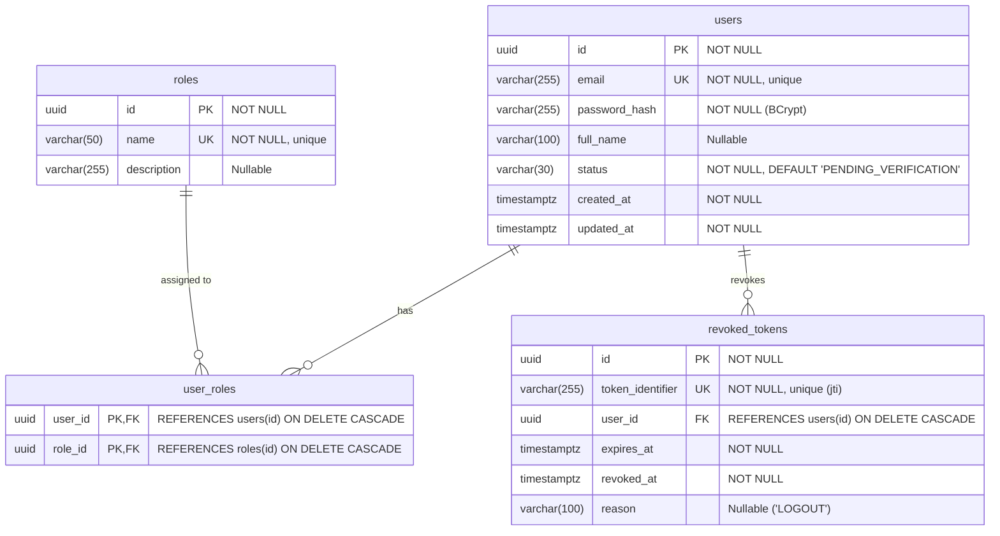

# Database Schema: Authentication & RBAC (Module 01)

This document details the relational database schema implemented in **Flyway Migration V1** (`V1__create_authentication_schema.sql`).

---

## 1. Database Architecture & Engine

- **RDBMS**: PostgreSQL 16 / 17
- **Migration Tool**: Flyway (`spring.flyway.enabled=true`, `baseline-on-migrate=false`)
- **Schema Management Policy**: Flyway is the exclusive owner of DDL. Hibernate runs with `ddl-auto=validate` to enforce synchronization at startup.
- **Data Types**: Strict UUID primary keys, TIMESTAMPTZ (UTC) for all timestamps.

---

## 2. Entity-Relationship Diagram

---

## 3. Detailed Table Specifications

### 3.1 `roles`
Stores system-defined access roles. Seeded during initial migration; immutable at runtime.

| Column | Type | Constraints | Description |
| :--- | :--- | :--- | :--- |
| `id` | `UUID` | `PRIMARY KEY` | Unique role identifier. |
| `name` | `VARCHAR(50)` | `NOT NULL, UNIQUE` | Role name (`USER`, `ANALYST`, `MODERATOR`, `ADMIN`, `RESEARCHER`). |
| `description` | `VARCHAR(255)` | - | Human-readable role description. |

---

### 3.2 `users`
Stores user authentication records and account lifecycle status.

| Column | Type | Constraints | Description |
| :--- | :--- | :--- | :--- |
| `id` | `UUID` | `PRIMARY KEY` | Unique user account identifier. |
| `email` | `VARCHAR(255)` | `NOT NULL, UNIQUE` | Normalised email address used as the login identifier. |
| `password_hash`| `VARCHAR(255)` | `NOT NULL` | BCrypt salted hash of user password. |
| `full_name` | `VARCHAR(100)` | - | Optional user display name. |
| `status` | `VARCHAR(30)` | `NOT NULL, DEFAULT 'PENDING_VERIFICATION'` | `CHECK (status IN ('ACTIVE', 'SUSPENDED', 'PENDING_VERIFICATION'))`. |
| `created_at` | `TIMESTAMPTZ` | `NOT NULL` | Account creation timestamp. |
| `updated_at` | `TIMESTAMPTZ` | `NOT NULL` | Timestamp when user profile was last updated. |

#### Indexes:
- `uq_users_email` (implicit unique index on `email`).
- `idx_users_status` on `status` (supports querying by account status).

---

### 3.3 `user_roles`
Join table managing many-to-many relationships between `users` and `roles`.

| Column | Type | Constraints | Description |
| :--- | :--- | :--- | :--- |
| `user_id` | `UUID` | `NOT NULL, FK → users(id) ON DELETE CASCADE` | Associated user identifier. |
| `role_id` | `UUID` | `NOT NULL, FK → roles(id) ON DELETE CASCADE` | Associated role identifier. |

#### Constraints & Indexes:
- Composite primary key: `PRIMARY KEY (user_id, role_id)`.
- Foreign key: `fk_user_roles_user` references `users(id)` with `ON DELETE CASCADE`.
- Foreign key: `fk_user_roles_role` references `roles(id)` with `ON DELETE CASCADE`.
- `idx_user_roles_user_id` on `user_id`.
- `idx_user_roles_role_id` on `role_id`.

---

### 3.4 `revoked_tokens`
Stores identifiers of revoked JWT access tokens to prevent reuse after logout.

| Column | Type | Constraints | Description |
| :--- | :--- | :--- | :--- |
| `id` | `UUID` | `PRIMARY KEY` | Revocation record primary key. |
| `token_identifier` | `VARCHAR(255)` | `NOT NULL, UNIQUE` | JWT unique ID (`jti`). Full JWT string is never stored. |
| `user_id` | `UUID` | `NOT NULL, FK → users(id) ON DELETE CASCADE` | User who revoked the token. |
| `expires_at` | `TIMESTAMPTZ` | `NOT NULL` | Original expiration time of the token. |
| `revoked_at` | `TIMESTAMPTZ` | `NOT NULL` | Timestamp when revocation was requested. |
| `reason` | `VARCHAR(100)` | - | Revocation trigger (e.g. `'LOGOUT'`). |

#### Indexes:
- `uq_revoked_tokens_token_id` (implicit unique index on `token_identifier` for high-throughput lookup during JWT filter evaluation).
- `idx_revoked_tokens_expires_at` on `expires_at` (supports future scheduled cleanup job to purge expired revocations).
- `idx_revoked_tokens_user_id` on `user_id`.

---

## 4. System Seed Data (Initial Migration)

The V1 migration populates the `roles` table with fixed, reproducible UUIDs across all environments:

| Role Name | Seed UUID | Description |
| :--- | :--- | :--- |
| `USER` | `a1b2c3d4-e5f6-4a7b-8c9d-0e1f2a3b4c5d` | Standard registered user with baseline access. |
| `ANALYST` | `b2c3d4e5-f6a7-4b8c-9d0e-1f2a3b4c5d6e` | Forensic analyst with access to analysis pipelines. |
| `MODERATOR` | `c3d4e5f6-a7b8-4c9d-0e1f-2a3b4c5d6e7f` | Content and community moderator for reviews. |
| `ADMIN` | `d4e5f6a7-b8c9-4d0e-1f2a-3b4c5d6e7f8a` | Platform administrator with full privileges. |
| `RESEARCHER` | `e5f6a7b8-c9d0-4e1f-2a3b-4c5d6e7f8a9b` | Academic or independent researcher. |

---

## 5. Future Schema Integrations

Upcoming modules will introduce additional relational tables that link directly to `users.id`:
- **Module 02**: `media` (`user_id` FK → `users.id`)
- **Module 17**: `investigation_cases` (`created_by_user_id` FK → `users.id`)
- **Module 20**: `audit_logs` (`actor_user_id` FK → `users.id`)
