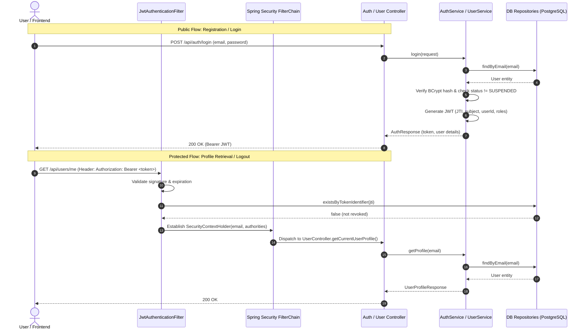

# Module 01: Authentication, RBAC & User Management

This document provides complete, accurate documentation for **Module 01: Authentication, RBAC & User Management** in the TruthLens platform, reflecting the actual codebase implementation.

---

## 1. Executive Summary & Module Identity

- **Module ID**: Module 01
- **Module Name**: Authentication, RBAC & User Management
- **Blueprint Reference**: Section C (Module 01), Section B (Role Matrix), Section G (Routes), Section H (Security)
- **Primary Blueprint Owner**: Yashas
- **Target Persona Access**: All personas (`USER`, `ANALYST`, `MODERATOR`, `ADMIN`, `RESEARCHER`)
- **Core Package**: `com.truthlens.backend`

---

## 2. Implementation Status: Implemented vs. Planned

To maintain strict truthfulness between the codebase and blueprint specifications:

| Capability | Status | Implementation Details |
| :--- | :--- | :--- |
| **User Registration** | **Implemented** | `POST /api/auth/register`, BCrypt hashing, duplicate email detection, auto-assigns `USER` role. |
| **User Authentication (Login)** | **Implemented** | `POST /api/auth/login`, email/password verification, account status validation, returns signed JWT. |
| **User Logout & Token Revocation** | **Implemented** | `POST /api/auth/logout`, stores JWT `jti` in `revoked_tokens` table, checked on every subsequent request. |
| **User Profile Management** | **Implemented** | `GET /api/users/me` and `PUT /api/users/me` for authenticated user profile retrieval and editing. |
| **Role-Based Access Control (RBAC)** | **Implemented** | 5 system roles (`USER`, `ANALYST`, `MODERATOR`, `ADMIN`, `RESEARCHER`), method-level `@PreAuthorize`, verified via `RbacTestController`. |
| **JWT Generation & Validation** | **Implemented** | HMAC-SHA256 with JJWT 0.12.6, custom claims (`userId`, `roles`), stateless token verification. |
| **Database Schema & Migrations** | **Implemented** | Flyway migration `V1__create_authentication_schema.sql` creates tables & seeds roles. |
| **Global Error Handling** | **Implemented** | `GlobalExceptionHandler` mapping domain exceptions and validation errors to structured `ApiErrorResponse`. |
| **Automated Testing Suite** | **Implemented** | 57 automated tests across 8 test classes (unit, slice, and integration tests). |
| **React Frontend Auth Pages & Guards** | *Planned* | Login/Register UI, token storage in browser, React Router protected routes. |
| **Multi-Factor Authentication (MFA/2FA)**| *Planned* | Blueprint specifies MFA for Analyst/Admin roles; deferred to future authentication enhancements. |
| **Email Verification Flow** | *Planned* | `PENDING_VERIFICATION` status exists in DB/entity, but SMTP token emailing is planned for a dedicated notification service. |
| **Password Reset via Email** | *Planned* | Forgot password / tokenized reset flow. |
| **Revoked Token Expiration Cleanup Job** | *Planned* | Scheduled `@Scheduled` cron job to delete expired rows from `revoked_tokens`. |

---

## 3. Architecture & Request Flow

---

## 4. Roles & RBAC Authorization

TruthLens establishes five system-level access roles seeded via Flyway migration `V1__create_authentication_schema.sql`:

| Role Name | Authority String | Description | Blueprint Persona |
| :--- | :--- | :--- | :--- |
| `USER` | `ROLE_USER` | Baseline access. Media upload, standard detection summary view. | General Public, Journalists |
| `ANALYST` | `ROLE_ANALYST` | Deep forensic tools, ELA heatmaps, Grad-CAM, case dossiers, signed reports. | Forensic Analysts, Cyber Investigators |
| `MODERATOR` | `ROLE_MODERATOR` | Content queue inspection, claim verification dispute/approval. | Fact Checkers, Content Moderators |
| `ADMIN` | `ROLE_ADMIN` | Platform administration, audit logs, model & risk weight configuration. | System Administrators |
| `RESEARCHER` | `ROLE_RESEARCHER` | Read-only dataset access, analytical benchmarks. | Academic & Independent Researchers |

### RBAC Enforcement

- **Method-Level Security**: Enabled via `@EnableMethodSecurity(prePostEnabled = true)` in [SecurityConfig.java](file:///c:/Users/Yashas%20H%20L/IdeaProjects/TruthLens/TruthLens-Authenticity-Platform/backend/src/main/java/com/truthlens/backend/config/SecurityConfig.java).
- **Annotation Pattern**: Controllers and service methods declare role constraints via `@PreAuthorize("hasRole('ANALYST')")` or combined expressions.
- **Verification Endpoints**: Dedicated test endpoints under `/api/rbac/` verify authorization rules for each role.

---

## 5. Security Configuration & JWT Handling

### Spring Security 6 Filter Chain

Configured in [SecurityConfig.java](file:///c:/Users/Yashas%20H%20L/IdeaProjects/TruthLens/TruthLens-Authenticity-Platform/backend/src/main/java/com/truthlens/backend/config/SecurityConfig.java):
- **CSRF**: Disabled (REST API stateless model).
- **Session Policy**: `SessionCreationPolicy.STATELESS` — no `HttpSession` objects created.
- **Authentication Entry Point**: Returns `HTTP 401 Unauthorized` for missing/invalid credentials.
- **Public Endpoints**:
  - `POST /api/auth/register`
  - `POST /api/auth/login`
- **Protected Endpoints**:
  - `POST /api/auth/logout` (requires authenticated JWT)
  - `GET /api/users/**`, `PUT /api/users/**`
  - `GET /api/rbac/**`
  - All other routes (`.anyRequest().authenticated()`)
- **Filter Placement**: `JwtAuthenticationFilter` is executed before Spring's `UsernamePasswordAuthenticationFilter`.

### JWT Service (`JwtService.java`)

- **Algorithm**: HMAC-SHA256 (`HS256`) via `Keys.hmacShaKeyFor(secretBytes)`.
- **Secret Key**: Minimum 256 bits (32 bytes) configured via `truthlens.jwt.secret` environment variable.
- **Standard Claims**:
  - `sub`: User's normalized email address.
  - `iat`: Token issuance timestamp.
  - `exp`: Expiration timestamp (default: 24 hours / 86,400,000 ms).
  - `jti`: Unique UUID string identifier for revocation tracking.
- **Custom Claims**:
  - `userId`: String representation of user UUID.
  - `roles`: List of authority strings with `ROLE_` prefix (e.g. `["ROLE_USER"]`).

### Logout & Revocation (`JwtAuthenticationFilter.java` & `AuthService.java`)

1. User calls `POST /api/auth/logout` with `Authorization: Bearer <token>`.
2. Controller parses the token and extracts `jti` and `exp`.
3. `AuthService.logout()` saves a record into `revoked_tokens` table with reason `"LOGOUT"`. The operation is idempotent.
4. On subsequent requests, `JwtAuthenticationFilter` intercepts the request, checks `revokedTokenRepository.existsByTokenIdentifier(jti)`, and rejects revoked tokens without authenticating the security context.

---

## 6. Password Handling

- **Algorithm**: BCrypt password hashing via Spring Security's `BCryptPasswordEncoder` configured in [PasswordEncoderConfig.java](file:///c:/Users/Yashas%20H%20L/IdeaProjects/TruthLens/TruthLens-Authenticity-Platform/backend/src/main/java/com/truthlens/backend/config/PasswordEncoderConfig.java).
- **Input Constraints**: Minimum 8 characters, maximum 128 characters enforced at DTO validation level.
- **Zero Exposure**: Plaintext passwords and raw hash strings are never logged or returned in DTOs.

---

## 7. Database Persistence Schema (PostgreSQL)

Defined in [V1__create_authentication_schema.sql](file:///c:/Users/Yashas%20H%20L/IdeaProjects/TruthLens/TruthLens-Authenticity-Platform/backend/src/main/resources/db/migration/V1__create_authentication_schema.sql):

### 1. `roles` Table
- `id` (UUID, PK)
- `name` (VARCHAR(50), UNIQUE, NOT NULL)
- `description` (VARCHAR(255))
- Seeded with 5 static UUIDs for `USER`, `ANALYST`, `MODERATOR`, `ADMIN`, `RESEARCHER`.

### 2. `users` Table
- `id` (UUID, PK)
- `email` (VARCHAR(255), UNIQUE, NOT NULL)
- `password_hash` (VARCHAR(255), NOT NULL)
- `full_name` (VARCHAR(100))
- `status` (VARCHAR(30), NOT NULL, DEFAULT `'PENDING_VERIFICATION'`)
  - Check constraint: `status IN ('ACTIVE', 'SUSPENDED', 'PENDING_VERIFICATION')`
- `created_at` (TIMESTAMPTZ, NOT NULL)
- `updated_at` (TIMESTAMPTZ, NOT NULL)
- Index on `status`.

### 3. `user_roles` Table
- `user_id` (UUID, FK → `users.id` ON DELETE CASCADE)
- `role_id` (UUID, FK → `roles.id` ON DELETE CASCADE)
- Composite PK `(user_id, role_id)`.
- Indexes on `user_id` and `role_id`.

### 4. `revoked_tokens` Table
- `id` (UUID, PK)
- `token_identifier` (VARCHAR(255), UNIQUE, NOT NULL) — stores `jti`
- `user_id` (UUID, FK → `users.id` ON DELETE CASCADE)
- `expires_at` (TIMESTAMPTZ, NOT NULL)
- `revoked_at` (TIMESTAMPTZ, NOT NULL)
- `reason` (VARCHAR(100))
- Indexes on `token_identifier`, `expires_at`, `user_id`.

---

## 8. REST APIs & Data Transfer Objects

### Implemented Endpoints

| Endpoint | Method | Security | Request DTO | Response DTO / Code |
| :--- | :--- | :--- | :--- | :--- |
| `/api/auth/register` | `POST` | Public | `RegisterRequest` | `AuthResponse` (HTTP 201) |
| `/api/auth/login` | `POST` | Public | `LoginRequest` | `AuthResponse` (HTTP 200) |
| `/api/auth/logout` | `POST` | Authenticated | None (Bearer Header) | `LogoutResponse` (HTTP 200) |
| `/api/users/me` | `GET` | Authenticated | None | `UserProfileResponse` (HTTP 200) |
| `/api/users/me` | `PUT` | Authenticated | `UpdateProfileRequest` | `UserProfileResponse` (HTTP 200) |
| `/api/rbac/user` | `GET` | `ROLE_USER` | None | `{"message": "Authorized: USER"}` |
| `/api/rbac/analyst` | `GET` | `ROLE_ANALYST` | None | `{"message": "Authorized: ANALYST"}` |
| `/api/rbac/moderator`| `GET` | `ROLE_MODERATOR`| None | `{"message": "Authorized: MODERATOR"}` |
| `/api/rbac/admin` | `GET` | `ROLE_ADMIN` | None | `{"message": "Authorized: ADMIN"}` |
| `/api/rbac/researcher`| `GET` | `ROLE_RESEARCHER`| None | `{"message": "Authorized: RESEARCHER"}` |

### DTO Definitions

- **`RegisterRequest`**: `email` (valid email, max 255), `password` (min 8, max 128), `fullName` (optional, max 100).
- **`LoginRequest`**: `email` (required, valid email), `password` (required).
- **`AuthResponse`**: `message`, `token`, `tokenType` (`"Bearer"`), `userId`, `email`, `fullName`, `status`, `roles`, `createdAt`.
- **`LogoutResponse`**: `message` (`"Logout successful"`).
- **`UserProfileResponse`**: `id`, `email`, `fullName`, `status`, `roles`, `createdAt`, `updatedAt`.
- **`UpdateProfileRequest`**: `fullName` (max 100).
- **`ApiErrorResponse`**: `status` (HTTP status int), `error` (error code string), `message` (safe error description), `path` (request URI), `timestamp` (UTC instant).

---

## 9. Error Handling & HTTP Status Codes

Centrally handled by [GlobalExceptionHandler.java](file:///c:/Users/Yashas%20H%20L/IdeaProjects/TruthLens/TruthLens-Authenticity-Platform/backend/src/main/java/com/truthlens/backend/exception/GlobalExceptionHandler.java):

| Exception | HTTP Status | Error Code | Description |
| :--- | :--- | :--- | :--- |
| `MethodArgumentNotValidException` | `400 Bad Request` | `VALIDATION_ERROR` | Bean validation constraint violation. |
| `InvalidCredentialsException` | `401 Unauthorized` | `INVALID_CREDENTIALS` | Invalid email/password, or malformed/missing auth header. |
| `AccountSuspendedException` | `403 Forbidden` | `ACCOUNT_SUSPENDED` | User status is `SUSPENDED`. |
| `AccessDeniedException` | `403 Forbidden` | `FORBIDDEN` | Insufficient role authority for requested resource. |
| `UserNotFoundException` | `404 Not Found` | `USER_NOT_FOUND` | User entity not found for given identity. |
| `EmailAlreadyExistsException` | `409 Conflict` | `EMAIL_ALREADY_EXISTS` | Email address is already registered. |
| `RoleNotFoundException` | `500 Internal Server Error`| `CONFIGURATION_ERROR`| Seed role missing from database. |
| General `Exception` | `500 Internal Server Error`| `INTERNAL_SERVER_ERROR`| Unexpected runtime exception. |

---

## 10. Automated Testing Suite

The repository contains 8 test classes comprising **57 automated tests** (all passing):

1. **`AuthServiceTest`** (15 tests): Unit tests verifying registration, duplicate email handling, BCrypt hashing, default role assignment, login authentication, suspended account checks, token revocation idempotency, and edge-case exceptions.
2. **`UserServiceTest`** (5 tests): Unit tests verifying user profile retrieval, full name updating, safe attribute masking, and not-found exceptions.
3. **`JwtServiceTest`** (6 tests): Unit tests verifying token issuance, claim parsing (`userId`, `roles`, `sub`, `jti`, `exp`), valid signature verification, and rejection of expired/tampered tokens.
4. **`JwtAuthenticationFilterTest`** (8 tests): Slice tests verifying header parsing (`Bearer ` prefix enforcement), revoked token detection, empty/null token handling, and SecurityContext population.
5. **`UserControllerTest`** (8 tests): MockMvc tests verifying `GET /api/users/me` and `PUT /api/users/me` security, input validation, and HTTP response codes.
6. **`RbacAuthorizationTest`** (9 tests): Security tests verifying `@PreAuthorize` rules on `/api/rbac/**` for authorized vs. unauthorized role combinations.
7. **`LogoutIntegrationTest`** (5 tests): Integration tests verifying token revocation persistence, database recording of `jti`, and subsequent rejection of logged-out tokens.
8. **`TruthLensBackendApplicationTests`** (1 test): Spring context boot test verifying healthy application bootstrap.

---

## 11. Integration Points with Future Modules

Module 01 provides the fundamental security and user context for all subsequent 19 modules:

- **Module 02 (Media Upload & Ingestion)**: Ingestion controllers will extract the user UUID from `SecurityContextHolder` to associate uploaded files with `media.user_id`.
- **Modules 05–14 (Detection Engines)**: Protected endpoints ensure only authenticated jobs can be enqueued.
- **Module 15 (Risk Engine) & 16 (Dashboard)**: Output visibility (e.g. detailed forensic maps vs. high-level scores) is filtered according to whether the user holds `ROLE_ANALYST` or `ROLE_USER`.
- **Module 17 (Investigation Case Management)**: Case assignments require `ROLE_ANALYST` or `ROLE_ADMIN` identities.
- **Module 20 (Security & Audit Monitoring)**: Audit logging interceptors capture caller `sub` and `userId` from the JWT to maintain immutable tamper-evident logs.
