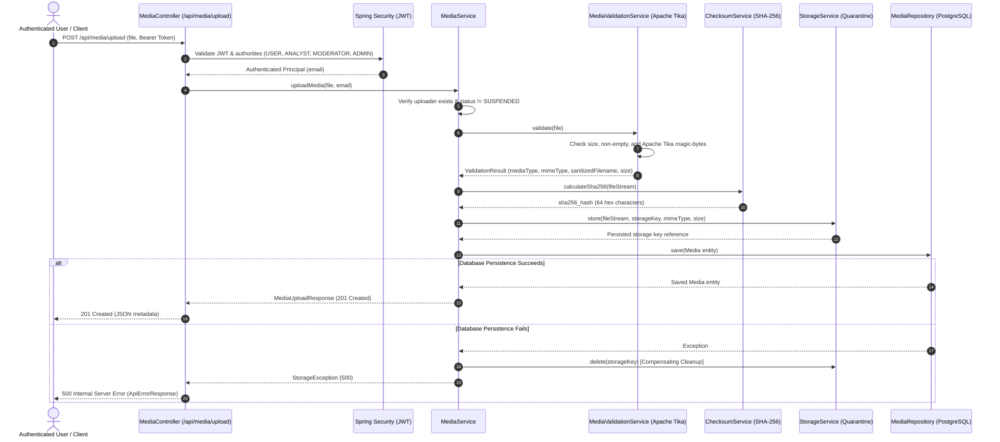

# Module 02: Media Upload & Secure Ingestion

This document details the backend architecture, security controls, persistence models, and API specifications for **Module 02: Media Upload & Secure Ingestion** in TruthLens.

---

## 1. Executive Summary & Module Identity

- **Module ID**: Module 02
- **Module Name**: Media Upload & Secure Ingestion
- **Blueprint Reference**: Section C (Module 02), Section D (Architecture), Section F (Data Architecture), Section G (REST Routes), Section H (Security Architecture)
- **Primary Blueprint Owner**: Yashas (+ Vishal)
- **Target Personas**: `USER`, `ANALYST`, `MODERATOR`, `ADMIN`
- **Core Package**: `com.truthlens.backend`

---

## 2. Implementation Status: Implemented vs. Planned

| Capability | Status | Implementation Details |
| :--- | :--- | :--- |
| **Secure Multipart Ingestion** | **Implemented** | `POST /api/media/upload` accepting `multipart/form-data`, authenticated via Spring Security JWT. |
| **Apache Tika Magic-Byte Validation** | **Implemented** | Inspects true binary content via `MediaValidationService`. Rejects spoofed extensions and client MIME headers. |
| **Supported Media Categories** | **Implemented** | Categorizes valid uploads into `IMAGE`, `VIDEO`, `AUDIO`, `TEXT`. |
| **Cryptographic SHA-256 Hashing** | **Implemented** | `ChecksumService` streams bytes through JVM `MessageDigest` to produce deterministic 64-character hex hash. |
| **Quarantined Storage Engine** | **Implemented** | `LocalStorageService` with path traversal defense; `StorageService` interface ready for S3/MinIO. |
| **Server-Controlled Storage Keys** | **Implemented** | `StorageKeyGenerator` formats keys as `quarantine/<type>/<yyyyMMdd>/<uuid>.<ext>`. |
| **Compensating Rollback Cleanup** | **Implemented** | Automatically deletes quarantined file if PostgreSQL metadata save fails. |
| **PostgreSQL Persistence** | **Implemented** | Flyway migration `V2__create_media_schema.sql` creates `media` table with FK to `users.id` and indexes. |
| **Metadata Inspection & Retrieval** | **Implemented** | `GET /api/media/{id}` and `GET /api/media/my` endpoints. |
| **Comprehensive Test Suite** | **Implemented** | 35 automated tests covering validation, hashing, storage, error handling, and WebMvc integration. |
| **React Drag-and-Drop Dropzone UI** | *Planned* | Frontend client upload UI deferred to dedicated frontend development milestone. |
| **MinIO / S3 Object Storage Deployment** | *Planned* | Pluggable via existing `StorageService` abstraction; local quarantine active. |

---

## 3. Architecture & Ingestion Flow



---

## 4. Supported Media Categories & MIME Mappings

TruthLens categorizes valid multimedia into four distinct types via magic-byte inspection:

| Media Category | MIME Types Validated via Apache Tika | Target Forensic Analysis |
| :--- | :--- | :--- |
| **`IMAGE`** | `image/jpeg`, `image/png`, `image/webp`, `image/gif`, `image/bmp`, `image/tiff` | Module 05: Error Level Analysis (ELA), FFT, Diffusion Artifacts |
| **`VIDEO`** | `video/mp4`, `video/quicktime`, `video/x-msvideo`, `video/webm`, `video/x-matroska`, `video/mpeg` | Module 06: Deepfake face detection, temporal consistency |
| **`AUDIO`** | `audio/mpeg`, `audio/mp3`, `audio/wav`, `audio/x-wav`, `audio/ogg`, `audio/flac`, `audio/x-m4a`, `audio/mp4`, `audio/aac`, `audio/x-aiff` | Module 07: Mel-spectrogram analysis, synthetic voice detection |
| **`TEXT`** | `text/plain`, `text/csv`, `text/tab-separated-values`, `application/json`, `application/pdf` | Module 11/12: Claim extraction, evidence retrieval |

---

## 5. Security & Isolation Controls

1. **Zero Trust for Client MIME Headers**:
   Browsers can easily spoof the `Content-Type` header (e.g. sending a shell script as `image/jpeg`). The ingestion pipeline ignores client assertions and feeds input streams directly into Apache Tika's magic-byte detector.
2. **Exclusion of HTML Content**:
   `text/html` is intentionally rejected from the supported MIME whitelist to eliminate any risk of future Stored Cross-Site Scripting (XSS) when textual media is analyzed or reviewed downstream.
3. **Strict Filename Sanitization**:
   Client filenames are sanitized to prevent directory traversal (`../`, `..\`), shell meta-characters, null bytes, and control characters before metadata recording.
4. **Isolated Quarantined Storage**:
   Files are never stored using client filenames or directly in web-accessible directories. Server-controlled storage keys follow:
   ```
   quarantine/{media_type}/{yyyyMMdd}/{uuid}.{ext}
   ```
5. **Path Traversal Guards**:
   `LocalStorageService` resolves all storage paths against the configured root and verifies `resolvedPath.startsWith(rootLocation)`. Any attempt to escape the quarantine directory immediately aborts with `StorageException`.
6. **Compensating Rollback Cleanup (`saveAndFlush`)**:
   Database persistence executes via `saveAndFlush()` to guarantee immediate database constraint evaluation within the compensating try/catch block. If persistence fails, the quarantined file is immediately deleted from storage, and failures during cleanup are safely handled without swallowing the primary persistence root cause.
7. **Object-Level Authorization (IDOR Defense)**:
   Individual media retrieval via `GET /api/media/{id}` enforces strict ownership and RBAC rules at the service layer. Standard users (`ROLE_USER`) may only retrieve metadata for their own uploads. Attempts by non-owners to inspect media records are rejected with `403 Forbidden` (`FORBIDDEN`). Elevated roles (`ROLE_ANALYST`, `ROLE_MODERATOR`, `ROLE_ADMIN`) retain authorized cross-user access to review and moderate forensic cases.
8. **No Execution as Code**:
   Uploaded files are treated strictly as passive binary data in quarantined storage.

---

## 6. Database Schema (Flyway V2)

Managed by Flyway migration [V2__create_media_schema.sql](file:///c:/Users/Yashas%20H%20L/IdeaProjects/TruthLens/TruthLens-Authenticity-Platform/backend/src/main/resources/db/migration/V2__create_media_schema.sql):

```sql
CREATE TABLE media (
    id                UUID         NOT NULL,
    user_id           UUID         NOT NULL,
    original_filename VARCHAR(255) NOT NULL,
    storage_path      VARCHAR(500) NOT NULL,
    media_type        VARCHAR(20)  NOT NULL,
    mime_type         VARCHAR(100) NOT NULL,
    file_size         BIGINT       NOT NULL,
    sha256_hash       VARCHAR(64)  NOT NULL,
    upload_status     VARCHAR(30)  NOT NULL DEFAULT 'UPLOADED',
    created_at        TIMESTAMPTZ  NOT NULL,
    updated_at        TIMESTAMPTZ  NOT NULL,

    CONSTRAINT pk_media               PRIMARY KEY (id),
    CONSTRAINT fk_media_user          FOREIGN KEY (user_id) REFERENCES users (id) ON DELETE CASCADE,
    CONSTRAINT ck_media_media_type    CHECK (media_type IN ('IMAGE', 'VIDEO', 'AUDIO', 'TEXT')),
    CONSTRAINT ck_media_upload_status CHECK (upload_status IN ('UPLOADED', 'PROCESSING', 'COMPLETED', 'FAILED')),
    CONSTRAINT ck_media_file_size     CHECK (file_size > 0)
);

CREATE INDEX idx_media_user_id       ON media (user_id);
CREATE INDEX idx_media_sha256_hash   ON media (sha256_hash);
CREATE INDEX idx_media_media_type    ON media (media_type);
CREATE INDEX idx_media_upload_status ON media (upload_status);
CREATE INDEX idx_media_created_at    ON media (created_at DESC);
```

---

## 7. REST API Endpoints

- **`POST /api/media/upload`**: Authenticated multipart upload. Returns HTTP 201 with `MediaUploadResponse`.
- **`GET /api/media/{id}`**: Authenticated metadata retrieval by media UUID. Returns HTTP 200 with `MediaResponse`.
- **`GET /api/media/my`**: Authenticated user's upload history. Returns HTTP 200 with `List<MediaResponse>`.

---

## 8. Automated Test Coverage (35 Tests)

1. **`MediaValidationServiceTest`** (8 tests): Validates real JPEG, PNG, text, and PDF streams; verifies detection of spoofed extensions; rejects empty and oversized files; validates filename sanitization.
2. **`ChecksumServiceTest`** (4 tests): Tests SHA-256 correctness, determinism, distinct content differences, and null handling.
3. **`LocalStorageServiceTest`** (4 tests): Tests storing, loading, deleting, and path traversal rejection.
4. **`StorageKeyGeneratorTest`** (5 tests): Tests key generation, date-partitioning, and extension resolution.
5. **`MediaServiceTest`** (7 tests): Tests upload flow, user validation, suspended account checks, compensating storage cleanup on DB failure, ID retrieval, and user media listings.
6. **`MediaControllerTest`** (7 tests): Tests `POST /api/media/upload` (201 Created, 401 Unauthorized, 400 Bad Request on invalid media, 413 Payload Too Large) and `GET` endpoints.
