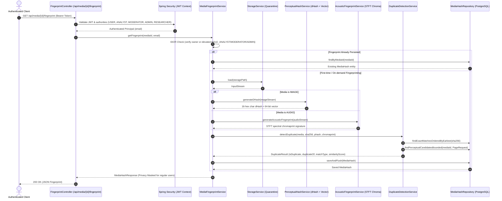

# Module 03: Media Fingerprinting & Duplicate Detection

This document details the architecture, fingerprinting algorithms, duplicate detection mechanics, persistence schema, and API specifications for **Module 03: Media Fingerprinting & Duplicate Detection** in TruthLens.

---

## 1. Executive Summary & Module Identity

- **Module ID**: Module 03
- **Module Name**: Media Fingerprinting & Duplicate Detection
- **Blueprint Reference**: Section C (Module 03), Section D (Architecture Flow), Section F (Data Architecture: `media_hashes`), Section G (REST Routes), Section H (Security Architecture)
- **Primary Blueprint Owner**: Yashas (+ Vishal)
- **Target Personas**: `ANALYST`, `MODERATOR`, `USER`, `RESEARCHER`, `SYSTEM`
- **Core Package**: `com.truthlens.backend.service.fingerprint`, `com.truthlens.backend.controller`, `com.truthlens.backend.entity`, `com.truthlens.backend.repository`

---

## 2. Implementation Status

| Capability | Status | Implementation Details |
| :--- | :--- | :--- |
| **Cryptographic SHA-256 Checksum** | **Implemented** | Reuses stream-verified 64-character hex SHA-256 digest from Module 02 for exact byte-level duplicate detection. |
| **Perceptual Image Hashing (dHash)** | **Implemented** | 64-bit gradient difference hashing via `PerceptualHashService`. Downsamples image to 9x8 grayscale and computes adjacent luminance gradient bits. |
| **Uniform Image Collision Defense** | **Implemented** | Remediates dHash collision on zero-variance flat images (F-04). Detects uniform rasters and encodes average luminance across the 64-bit hash, preventing false positive matches between solid black, white, and red while matching identical uniform images. |
| **Vector Similarity Representation** | **Implemented** | Generates 64-bit binary vector representation (`phash_vector`) aligned with blueprint vector similarity search. |
| **Acoustic Spectral Fingerprinting** | **Implemented** | `JavaSpectralAcousticFingerprintGenerator` extracts PCM audio via `AudioSystem` (invariant to metadata/container differences such as ID3 and RIFF chunks), computes STFT Hanning-windowed spectral magnitude across 16 logarithmic frequency bands, and quantizes differential energy across bands and consecutive frames (Chromaprint methodology). |
| **Acoustic Bit Error Rate Matching** | **Implemented** | `AcousticFingerprintService` calculates alignment-sliding Bit Error Rate (BER) similarity between acoustic sub-fingerprints, classifying matches at $\ge 80\%$ similarity. |
| **Deterministic Canonical Selection** | **Implemented** | Repository queries enforce strict `ORDER BY mh.media.createdAt ASC, mh.media.id ASC`, ensuring earliest uploaded media is deterministically selected as canonical `duplicateOf` (F-05). |
| **Bounded Database Candidate Retrieval**| **Implemented** | Candidate searches (`findPerceptualCandidatesBounded`, `findAcousticCandidatesBounded`) use indexed bounded pagination, eliminating unbounded full-table memory scans (P-01). |
| **N+1 Query Elimination** | **Implemented** | Repository queries use `JOIN FETCH mh.media m` to prevent lazy-loading N+1 query overhead (P-02). |
| **POST Catalog Re-evaluation** | **Implemented** | `POST /api/media/{id}/fingerprint` re-evaluates duplicate detection against the latest catalog and updates duplicate flags (F-03). |
| **PostgreSQL & Flyway Persistence** | **Implemented** | Flyway migration `V3__create_media_hashes_schema.sql` creates `media_hashes` table with foreign keys, cascade deletes, unique constraints, and B-Tree indexes. |
| **REST APIs** | **Implemented** | `GET /api/media/{id}/fingerprint`, `POST /api/media/{id}/fingerprint`, `GET /api/media/{id}/duplicates`. |
| **Role Authorization (incl. RESEARCHER)**| **Implemented** | Controller allows `USER`, `ANALYST`, `MODERATOR`, `ADMIN`, `RESEARCHER`. Researchers and standard users have read access to their own media (S-01). |
| **Cross-User Privacy (UUID Masking)** | **Implemented** | When a standard user or researcher matches another user's media, `duplicateOfMediaId` is masked to `null` and filenames are masked as `"Verified Reference Item"`. Elevated roles retain full provenance (S-02). |
| **Concurrency Race Safety** | **Implemented** | Concurrent generation catches unique constraint violations on `media_id` and idempotently returns the persisted record without unhandled 500 errors (S-03). |
| **Automated Test Suite** | **Implemented** | Comprehensive suite including real database Flyway integration tests (`MediaHashRepositoryIntegrationTest`), edge-case unit tests, and WebMvc tests (152/152 total test pass). |

---

## 3. Architecture Flow

---

## 4. Fingerprinting Modalities

### A. Cryptographic Hash (SHA-256)
- **Applicability**: All media types (`IMAGE`, `VIDEO`, `AUDIO`, `TEXT`).
- **Purpose**: Detect byte-for-byte exact copies.
- **Match Criteria**: Exact equality via deterministic query ordered by `createdAt ASC` (canonical duplicate selection).
- **Match Type**: `EXACT_SHA256` (Similarity Score: `1.0`).

### B. Perceptual Visual Hash (dHash) & Vector Representation
- **Applicability**: `IMAGE` (and image keyframes).
- **Algorithm**:
  1. Downsample image to 9x8 grayscale using smooth area scaling.
  2. Detect uniform color images: if pixel variance $\le 2$, encode average luminance across 64 bits to prevent solid black/white/red false positives.
  3. For gradient images, compute 64-bit gradient array by comparing horizontal adjacent pixels ($p[x, y] > p[x+1, y]$).
  4. Output 16-character hexadecimal string and 64-character binary vector representation (`phash_vector`).
- **Distance Metric**: Hamming distance (`Long.bitCount(h1 ^ h2)`).
- **Threshold**: Hamming distance $\le 10$ bits indicates a visual near-match ($\ge 84.4\%$ similarity).
- **Match Type**: `NEAR_MATCH_PHASH`.

### C. Acoustic Spectral Chromaprint
- **Applicability**: `AUDIO`.
- **Algorithm**:
  1. Extracts PCM audio via `AudioSystem` (ignoring container headers and ID3/RIFF metadata tags).
  2. Applies Hanning-windowed STFT (1024 samples, 50% overlap).
  3. Bins spectral power into 16 logarithmic frequency sub-bands.
  4. Computes differential quantization across adjacent frequency bands and consecutive frames.
  5. Evaluates Bit Error Rate (BER) across aligned sub-fingerprints with threshold $\ge 80\%$.
- **Match Type**: `ACOUSTIC_MATCH`.

---

## 5. Security & Privacy Controls

1. **Object-Level Authorization (IDOR Defense)**:
   Access to `/api/media/{id}/fingerprint` and `/api/media/{id}/duplicates` is verified against the authenticated user extracted from the verified JWT context. Non-owners with `ROLE_USER` or `ROLE_RESEARCHER` receive HTTP `403 Forbidden`.
2. **Cross-User Privacy Preservation (UUID & Filename Masking)**:
   When Media A uploaded by User 1 matches Media B uploaded by User 2, User 1 receives verified duplicate metrics (`matchType`, `similarityScore`), but User 2's sensitive details are masked: `duplicateOfMediaId` is set to `null` and filename is masked as `"Verified Reference Item"`. Elevated investigation roles (`ANALYST`, `MODERATOR`, `ADMIN`) retain full provenance visibility.
3. **Concurrency Race Resilience**:
   Idempotent persistence handles simultaneous fingerprint generation requests without database integrity exceptions or 500 errors.

---

## 6. Known Limitations

- **Native `fpcalc` CLI**: The pure Java STFT spectral acoustic generator provides robust in-process acoustic fingerprinting. If the native Chromaprint C-binary (`fpcalc`) is installed and configured in production environments, it can be attached via the `AcousticFingerprintGenerator` strategy.
- **Hardware-Accelerated Vector Indexing**: The current candidate retrieval uses bounded database queries with chunk/prefix indexing. Native `pgvector` HNSW/IVFFlat indexing can be activated when the `vector` PostgreSQL C-extension is installed in the target host environment.
