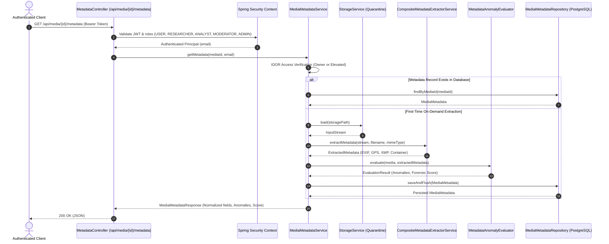

# Module 04: Metadata & Digital Forensics

This document details the architecture, extraction engines, forensic anomaly detection rules, schema, and API specifications for **Module 04: Metadata & Digital Forensics** in TruthLens.

---

## 1. Executive Summary & Module Identity

- **Module ID**: Module 04
- **Module Name**: Metadata & Digital Forensics
- **Blueprint Reference**: Section C (Module 04), Section D (Architecture Flow: `Media File -> ExifTool / MediaInfo Wrapper -> JSON Metadata Extractor -> Anomaly Detection Rules -> Metadata Forensic Score`), Section F (Data Architecture: `metadata`), Section G (REST Routes), Section H (Security Architecture)
- **Primary Blueprint Owner**: Vishal + Yashas
- **Target Personas**: `ANALYST`, `INVESTIGATOR`, `MODERATOR`, `ADMIN`, `USER`, `RESEARCHER`
- **Core Packages**:
  - `com.truthlens.backend.service.metadata`
  - `com.truthlens.backend.controller`
  - `com.truthlens.backend.entity`
  - `com.truthlens.backend.repository`
  - `com.truthlens.backend.dto`

---

## 2. Implementation Summary

| Capability | Status | Implementation Details |
| :--- | :--- | :--- |
| **Pure-Java Extraction Engine** | **Implemented** | `JavaMetadataExtractorEngine` utilizes Drew Noakes' `metadata-extractor` (v2.19.0) to parse EXIF (IFD0, SubIFD), GPS, IPTC, XMP, MP4/QuickTime video headers, standalone audio streams (WAV sample rate, channels, bit rate; MP3 sample rate, channel mode, bit rate), and container properties without native dependencies. Raw JSON is safely bounded at 512 KB. |
| **ExifTool / MediaInfo CLI Wrapper** | **Implemented** | `CliMetadataExtractorEngine` provides the blueprint-specified CLI wrapper for both ExifTool and MediaInfo. Separates stderr from stdout to prevent warning text from corrupting machine-readable JSON parsing. If native binaries are not installed on the system PATH, the application remains healthy and gracefully delegates to pure-Java extraction. |
| **Composite Extractor Architecture** | **Implemented** | `CompositeMetadataExtractorService` orchestrates engine execution. Safely buffers streams up to 25 MB so that CLI consumption or failure guarantees a fresh, unexhausted stream for deterministic fallback to the Java engine. |
| **Forensic Anomaly Rule Evaluator** | **Implemented** | `MetadataAnomalyEvaluator` evaluates 8 forensic rules including editing software detection (Photoshop, GIMP, Canva, CapCut), re-encoding tools (ffmpeg, HandBrake), future timestamps, reverse chronological modifications, stripped EXIF, camera/software mismatches, and GPS boundary/Null Island anomalies. |
| **Forensic Suspicion Score** | **Implemented** | Computes normalized score between `0.0000` (authentic) and `1.0000` (highly anomalous) with discrete risk classification (`CLEAN`, `SUSPICIOUS`, `HIGH_RISK`). |
| **PostgreSQL & Flyway Persistence** | **Implemented** | Flyway migration `V4__create_metadata_schema.sql` creates `metadata` table with 1:1 cascade relation to `media(id)`, check constraint `chk_metadata_forensic_score`, and B-Tree indexes. |
| **REST APIs** | **Implemented** | `GET /api/media/{id}/metadata`, `POST /api/media/{id}/metadata`, `GET /api/media/{id}/metadata/anomalies`, `GET /api/media/{id}/metadata/raw`. |
| **RBAC & IDOR Security** | **Implemented** | Full role matrix (`USER`, `RESEARCHER`, `ANALYST`, `MODERATOR`, `ADMIN`). Object-level authorization prevents unauthorized access, preserving privacy while allowing elevated analyst investigation. |
| **Concurrency & Idempotency** | **Implemented** | Idempotent on-demand extraction with unique constraint race handling (`DataIntegrityViolationException` recovery). |

---

## 3. Architecture Flow

---

## 4. Forensic Anomaly Detection Rules

| Rule ID | Category | Severity | Description | Score Impact |
| :--- | :--- | :---: | :--- | :---: |
| `ANOM_EDITING_SOFTWARE` | `SOFTWARE_MODIFICATION` | **HIGH** | Detects signatures of editing applications (Photoshop, GIMP, Canva, CapCut, Lightroom, Premiere, InDesign, After Effects). Suggests post-capture tampering or synthetic generation. | +0.35 |
| `ANOM_RE_ENCODING_SOFTWARE` | `SOFTWARE_MODIFICATION` | **MEDIUM** | Detects re-encoding utilities (ffmpeg, libx264, HandBrake, Lavf). Indicates container restructuring or format transcode. | +0.20 |
| `ANOM_FUTURE_CAPTURE_TIMESTAMP` | `TIMESTAMP_INCONSISTENCY` | **HIGH** | Capture timestamp occurs in the future relative to UTC time + 1h. Indicates forged EXIF or device clock tamper. | +0.35 |
| `ANOM_FUTURE_MODIFY_TIMESTAMP` | `TIMESTAMP_INCONSISTENCY` | **HIGH** | Modification timestamp occurs in the future relative to UTC time + 1h. | +0.35 |
| `ANOM_TIMESTAMP_INCONSISTENCY` | `TIMESTAMP_INCONSISTENCY` | **MEDIUM** | File modification timestamp precedes original capture timestamp, violating chronological causality. | +0.20 |
| `ANOM_METADATA_STRIPPED` | `METADATA_STRIPPED` | **LOW** | Image completely lacks EXIF, camera make, or model. Characteristic of social media re-encodings (WhatsApp, Twitter/X) or sanitization. | +0.05 |
| `ANOM_CAMERA_SOFTWARE_MISMATCH` | `DEVICE_INCONSISTENCY` | **HIGH** | Hardware camera manufacturer (e.g. Canon, Nikon, Sony) combined with mobile/web editing tool software tags. | +0.35 |
| `ANOM_GPS_OUT_OF_BOUNDS` | `GPS_ANOMALY` | **HIGH** | Latitude not in [-90, 90] or Longitude not in [-180, 180]. | +0.35 |
| `ANOM_GPS_NULL_ISLAND` | `GPS_ANOMALY` | **MEDIUM** | GPS coordinates recorded exactly at (0.0, 0.0), indicating uncalibrated receiver default or synthetic tag. | +0.20 |
| `ANOM_VIDEO_STREAM_INCONSISTENCY`| `CONTAINER_INCONSISTENCY`| **MEDIUM** | Video container format declared but lacks video track or codec metadata. | +0.20 |

---

## 5. Security & Access Control

- **IDOR Protection**: Object-level authorization via `MediaMetadataService.authorizeAndGetMedia` ensures callers can only access media they uploaded, unless they possess elevated permissions (`ROLE_ANALYST`, `ROLE_MODERATOR`, `ROLE_ADMIN`).
- **Researcher Role**: `ROLE_RESEARCHER` has read access to their own media metadata; unauthorized cross-user access attempts are rejected with `403 Forbidden`.
- **Privacy Defense**: Physical filesystem storage paths and server credentials are never exposed through metadata DTOs.
- **Fail-Safe Processing**: Corrupt media streams or unparseable metadata trees fail safely without leaking internal stack traces or causing server crashes.
- **Memory & Resource Protection**: Bounded composite stream buffering (max 25 MB) and bounded JSON serialization (max 512 KB) protect heap memory from exhaustion on oversized media or malicious metadata payloads.
