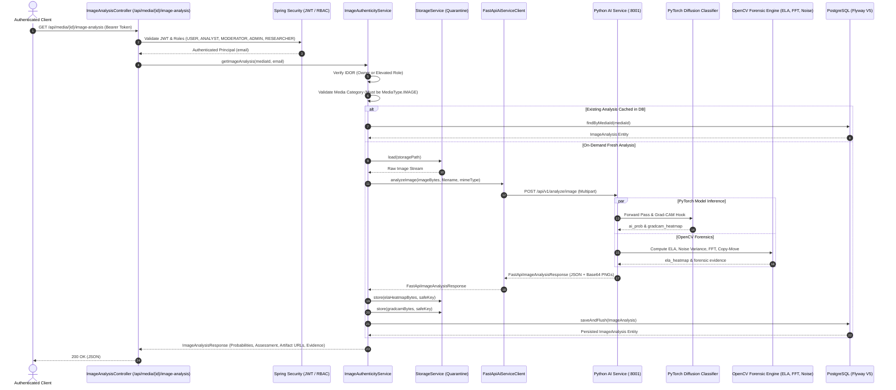

# Module 05: Image Authenticity Analysis

This document details the architecture, dual-engine analysis pipelines, machine learning model adapter, computer vision forensic algorithms, database schema, and API specifications for **Module 05: Image Authenticity Analysis** in TruthLens.

---

## 1. Executive Summary & Module Identity

- **Module ID**: Module 05
- **Module Name**: Image Authenticity Analysis
- **Category**: AI Vision & Forensics
- **Blueprint Reference**:
  - Section C: Module 05 (`Dual-engine image analyzer detecting synthetic AI generation and localized physical manipulations`)
  - Section D: Architecture Flow (`Image Tensor -> Python FastAPI -> PyTorch Model (Diffusion Classifier) + OpenCV ELA Generator -> AI Probability & ELA Heatmap PNG -> Spring Boot Backend`)
  - Section F: Data Architecture (`image_analysis` table: `ai_prob`, `ela_heatmap_url`, `manipulation_prob`)
  - Section G: REST Routes (`/api/media/{id}/image-analysis`)
  - Section H: Security Architecture (IDOR, Quarantined Artifact Storage, Role Authorization)
- **Primary Personas**: `ANALYST`, `MODERATOR`, `USER`, `ADMIN`, `RESEARCHER`
- **Downstream Integrations**:
  - Module 15: Risk Scoring Engine (consumes `ai_prob`, `manipulation_prob`, and forensic scores)
  - Module 16: Explainable Dashboard (visualizes ELA heatmap, Grad-CAM attention overlay, and spectral plots)
  - Module 19: Asynchronous Processing Queue (future background batch orchestration)

---

## 2. Implementation Summary

| Component | Status | Implementation Details |
| :--- | :--- | :--- |
| **Python FastAPI Microservice** | **Implemented** | Independent microservice located at `ai-ml/` running FastAPI, Uvicorn, PyTorch (CPU/CUDA), OpenCV, NumPy, and SciPy. Exposes `GET /api/v1/health` and `POST /api/v1/analyze/image`. |
| **PyTorch Diffusion Classifier Model** | **Implemented** | `DiffusionClassifierNet` CNN architecture with feature extractor, global average pooling, and dual classification heads. Includes safe Xavier baseline weights for development/testing (`TruthLens-DiffusionClassifier-0.1.0-dev`). Model architecture provides forward and backward gradient hooks for Grad-CAM. |
| **OpenCV Error Level Analysis (ELA)** | **Implemented** | Recompresses image via JPEG at quality 90, computes pixel difference against source, scales differences by factor 15, renders a JET colormap heatmap, and encodes as PNG. |
| **Laplacian Noise Variance Analysis** | **Implemented** | Computes global residual noise variance via 3x3 Laplacian filtering and evaluates regional variance across sliding 32x32 pixel patches to compute spatial noise inconsistency. |
| **2D FFT Frequency-Domain Analysis** | **Implemented** | Computes 2D Fast Fourier Transform magnitude spectrum with DC shift, extracts azimuthal high-frequency energy ratio, calculates radial falloff slope, and detects periodic spectral spike anomalies typical of generative upsampling or cloning. |
| **Copy-Move & Splicing Tampering Detector** | **Implemented** | Extracts keypoints and descriptors via OpenCV ORB, performs spatial distance clustering, and flags localized physical cloning/splicing patterns. |
| **Grad-CAM Attention Exporter** | **Implemented** | Computes activation gradients of target convolution layer via backward pass, calculates channel importance weights, generates 2D attention heatmap, and overlays onto original image with Jet colormap blending. |
| **Spring Boot Client & Orchestrator** | **Implemented** | `FastApiAiServiceClient` (using Spring `RestClient`) connects to FastAPI with configurable connect/read timeouts. `ImageAuthenticityService` enforces IDOR authorization, image media validation, artifact storage, and idempotent on-demand caching. |
| **Secure Quarantined Artifact Storage** | **Implemented** | Visual heatmap artifacts (ELA and Grad-CAM) returned as base64 are safely decoded and stored through `StorageService` using server-generated isolated keys (`quarantine/image/...`). Internal storage paths and server filesystem paths are never exposed to clients. |
| **PostgreSQL Schema (Flyway V5)** | **Implemented** | Migration `V5__create_image_analysis_schema.sql` establishes `image_analysis` table with check constraints (`0.0 <= ai_prob, manipulation_prob <= 1.0`), unique constraint on `media_id`, foreign key with `ON DELETE CASCADE`, and B-Tree indexes. |
| **REST APIs** | **Implemented** | `GET /api/media/{id}/image-analysis`, `POST /api/media/{id}/image-analysis`, `GET /api/media/{id}/image-analysis/evidence`, and `GET /api/media/{id}/image-analysis/artifacts/{type}`. |

---

## 3. Architecture & Data Flow

---

## 4. Forensic Analysis Techniques & Algorithms

### 4.1 Error Level Analysis (ELA)
- **Mechanism**: When an image is saved in lossy JPEG format, the discrete cosine transform (DCT) compresses high-frequency content according to the quantization table. If an image is modified or spliced, the altered regions exhibit different compression error characteristics compared to unaltered regions.
- **Implementation**:
  - Recompress image in-memory at JPEG quality 90.
  - Compute absolute pixel difference between original RGB and recompressed RGB: $\Delta(x, y) = |I(x, y) - I_{\text{recompressed}}(x, y)|$.
  - Rescale difference by factor 15: $\text{Scaled} = \min(255, \Delta \times 15)$.
  - Apply `cv2.COLORMAP_JET` to produce an intuitive false-color heatmap showing compression error variance.

### 4.2 Spatial Noise Variance & Inconsistency Analysis
- **Mechanism**: Natural physical camera sensors introduce Gaussian/Poisson sensor noise uniformly across the image sensor surface. Splicing or localized generative inpainting disturbs this noise profile.
- **Implementation**:
  - Convert image to grayscale and apply 3x3 Laplacian operator kernel.
  - Calculate global noise variance: $\sigma^2 = \text{Var}(\nabla^2 I)$.
  - Extract sliding $32\times 32$ pixel patches across the image surface.
  - Compute local noise variance for each patch and calculate coefficient of variation ($CV = \frac{\text{std}}{\text{mean}}$) as the spatial noise inconsistency metric.

### 4.3 2D Fast Fourier Transform (FFT) Frequency Analysis
- **Mechanism**: Deep generative models (GANs, Latent Diffusion) often introduce subtle periodic lattice artifacts and abnormal high-frequency spectral roll-offs due to transposed convolution upsampling or attention mechanisms.
- **Implementation**:
  - Compute 2D discrete Fourier transform via `np.fft.fft2` and center zero frequency via `np.fft.fftshift`.
  - Compute power spectrum: $P(u, v) = \log(1 + |\mathcal{F}(u, v)|^2)$.
  - Extract radial frequency profiles and calculate ratio of high-frequency energy against total spectral energy.
  - Detect high-frequency periodic spikes (values > 4.0 standard deviations above high-frequency band average).

### 4.4 Localized Tampering (Copy-Move & Splicing)
- **Mechanism**: Copy-move forgery duplicates image regions to conceal or replicate objects. Splicing inserts content from a different image.
- **Implementation**:
  - Extracts keypoint features and ORB descriptors.
  - Performs brute-force Hamming k-NN descriptor matching via OpenCV BFMatcher (`cv2.BFMatcher(cv2.NORM_HAMMING, crossCheck=False)` with $k=3$).
  - Filters out trivial self-matches and filters by spatial euclidean distance to identify distinct cloned patches.

### 4.5 Grad-CAM Attention Heatmap
- **Mechanism**: Gradient-weighted Class Activation Mapping computes gradients of target prediction class score with respect to feature maps of the final convolutional layer:
  $$\alpha_k = \frac{1}{Z} \sum_{i} \sum_{j} \frac{\partial y^c}{\partial A_{i, j}^k}$$
  $$L_{\text{Grad-CAM}}^c = \text{ReLU}\left(\sum_k \alpha_k A^k\right)$$
- **Implementation**:
  - Registered forward and backward hooks on the last convolutional stage of `DiffusionClassifierNet`.
  - Computes channel weights via global average pooling of gradients.
  - Resizes attention mask to original image dimensions and creates a semi-transparent JET colormap overlay.

---

## 5. Security & IDOR Enforcement

- **IDOR Protection**: Enforced at `ImageAuthenticityService.authorizeAndValidateMedia`. Standard users can only access analyses for their own uploaded media assets.
- **Role Elevation**: Privileged roles (`ROLE_ANALYST`, `ROLE_MODERATOR`, `ROLE_ADMIN`) have cross-user investigation privileges to inspect any media authenticity analysis.
- **Media Type Enforcement**: Assets with `media_type != MediaType.IMAGE` (e.g. video, audio) are rejected with `InvalidMediaException` (HTTP 400 Bad Request).
- **Quarantined Artifact Isolation**: Heatmap artifacts are stored within the quarantine storage boundary with UUID-based keys. Clients access artifacts strictly through the controller streaming route (`GET /api/media/{id}/image-analysis/artifacts/{type}`), preventing path traversal and storage key exposure.
- **Fail-Safe Resilience**: Downstream AI service timeouts or communication errors record an `AnalysisStatus.FAILED` entry in the database and throw `AiServiceException` (HTTP 502 Bad Gateway), preventing unhandled crashes or fabricated probability persistence.

---

## 6. Model Limitations & Development Baseline

> [!NOTE]
> The current model adapter uses `DiffusionClassifierNet` (`TruthLens-DiffusionClassifier-0.1.0-dev`). In this development/testing baseline, weights are initialized deterministically using fixed seed 42 with Xavier/Kaiming initialization to ensure reproducible execution across test runs and restarts. This is an untrained architectural baseline and does not represent a validated or production-accurate synthetic detector. All inference pipelines, gradient hooks, Grad-CAM attention exporters, and feature dimensions are fully functional and ready for production weight loading via the `TRUTHLENS_IMAGE_MODEL_PATH` (or `TRUTHLENS_AI_MODEL_PATH`) environment variable.
