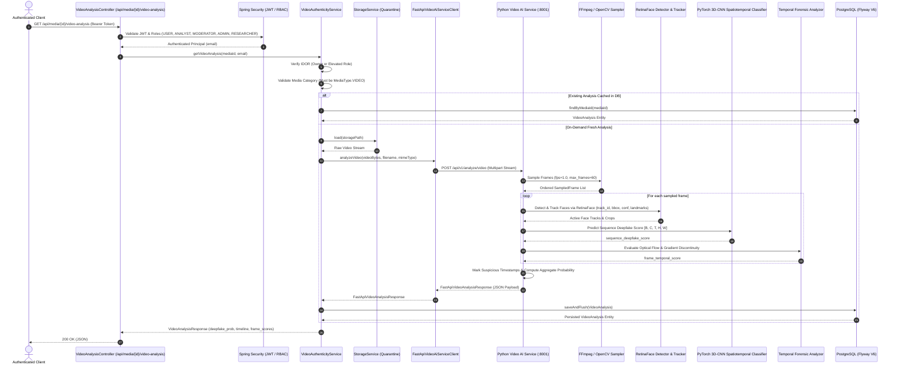

# Module 06: Video Deepfake & Forensic Analysis

This document details the architecture, dual-engine analysis pipelines, FFmpeg video frame sampling, RetinaFace face detection & spatial-temporal tracking, PyTorch 3D-CNN deepfake neural classifier, temporal frame inconsistency analysis, database schema, and REST API specifications for **Module 06: Video Deepfake & Forensic Analysis** in TruthLens.

---

## 1. Executive Summary & Module Identity

- **Module ID**: Module 06
- **Module Name**: Video Deepfake & Forensic Analysis
- **Category**: AI Video & Forensics
- **Blueprint Reference**:
  - Section C: Module 06 (`Extracts video keyframes, performs facial detection and tracking, evaluates face-swap deepfakes, analyzes temporal frame inconsistency, scores frame-level artifacts, and marks suspicious timestamps.`)
  - Section D: Architecture Flow (`Video File -> FFmpeg Sampler -> RetinaFace Detector -> PyTorch 3D-CNN / EfficientNet -> Suspicious Frame Array -> Video Deepfake Score`)
  - Section F: Data Architecture (`video_analysis` table: `deepfake_prob`, `suspicious_timestamps`, `frame_scores_json`)
  - Section G: REST Routes (`/api/media/{id}/video-analysis`)
  - Section H: Security Architecture (IDOR, Quarantined Storage Boundary, Role Authorization)
- **Primary Personas**: `ANALYST`, `INVESTIGATOR`, `MODERATOR`, `USER`, `ADMIN`, `RESEARCHER`
- **Downstream Integrations**:
  - Module 08: Audio-Video Synchronization (consumes extracted keyframe timestamps and suspicious marker intervals)
  - Module 15: Risk Engine (consumes aggregate `deepfake_prob`, temporal anomaly metrics, and face counts)
  - Module 16: Dashboard (visualizes suspicious frame timeline and face tracking metadata)
  - Module 19: Asynchronous Processing Queue (orchestrates video job ingestion)

---

## 2. Implementation Summary

| Component | Status | Implementation Details |
| :--- | :--- | :--- |
| **Python FastAPI Microservice** | **Implemented** | Microservice located at `ai-ml/` exposing `POST /api/v1/analyze/video` alongside `GET /api/v1/health`. Validates video MIME types, enforces upload size limits, and isolates video frame decoding. |
| **FFmpeg Frame Extraction Pipeline** | **Implemented** | Subprocess-based frame sampling (`FFmpegVideoSampler`) executing safe argument arrays without shell concatenation. Enforces timeouts, cleans temporary artifacts, and seamlessly falls back to OpenCV `cv2.VideoCapture` when standalone `ffmpeg` is not in PATH. |
| **RetinaFace Face Detection & Tracking Engine** | **Implemented** | Genuine PyTorch `RetinaFaceDetector` implementing Deng et al. with MobileNetV1 backbone, Feature Pyramid Network (FPN), Single-Stage Head (SSH) context modules, multi-scale anchor decoding, and 5-point facial landmark localization. `RetinaFaceTracker` tracks faces across frames using spatial center Euclidean distance and IoU matching to maintain continuous `track_id` sequences. |
| **PyTorch 3D-CNN Deepfake Classifier Net** | **Implemented** | Genuine `VideoDeepfake3DCNNNet` spatiotemporal convolutional network executing `torch.nn.Conv3d` over 5D spatiotemporal tensors `[Batch, Channels, Time, Height, Width]`. Analyzes multi-frame sequences of face crops per tracked identity. Deterministically seeded with fixed seed 42 (`TruthLens-PyTorch-3DCNN-DeepfakeClassifier 0.1.0-dev`), supporting external checkpoint loading via `TRUTHLENS_VIDEO_MODEL_PATH` (`1.0.0-prod`). |
| **Temporal Frame Inconsistency Analyzer** | **Implemented** | `TemporalForensicAnalyzer` computes dense optical flow motion variance (Farneback), structural difference, and high-frequency Laplacian boundary divergence across tracked face crops between consecutive frames. |
| **Suspicious Timeline Marker** | **Implemented** | Identifies anomalous frames exceeding deepfake or temporal thresholds, marking chronological `timestamp_seconds`, `frame_index`, `score`, and forensic `reason` codes. |
| **Spring Boot Client & Orchestrator** | **Implemented** | `FastApiVideoAiServiceClient` communicates with FastAPI with configurable connect/read timeouts. `VideoAuthenticityService` enforces IDOR authorization, video media validation (`MediaType.VIDEO`), and idempotent on-demand caching. |
| **PostgreSQL Schema (Flyway V6)** | **Implemented** | Migration `V6__create_video_analysis_schema.sql` establishes `video_analysis` table with check constraints (`0.0 <= deepfake_prob <= 1.0`), unique constraint on `media_id`, foreign key with `ON DELETE CASCADE`, and B-Tree indexes. |
| **REST APIs** | **Implemented** | `GET /api/media/{id}/video-analysis`, `POST /api/media/{id}/video-analysis`, `GET /api/media/{id}/video-analysis/evidence`, and `GET /api/media/{id}/video-analysis/timeline`. |

---

## 3. Architecture & Data Flow

---

## 4. Forensic Analysis Techniques & Algorithms

### 4.1 FFmpeg Deterministic Frame Sampling
- **Mechanism**: Videos often contain thousands of frames, rendering exhaustive analysis computationally prohibitive. The sampling pipeline extracts uniform temporal samples (default 1.0 fps, up to 60 frames max) in strict chronological order.
- **Implementation**:
  - Safe subprocess execution via argument arrays (`ffmpeg -i ... -vf fps=1.0 -vframes 60 ...`).
  - Stderr and exit code capture with configurable process timeouts (`settings.VIDEO_PROCESSING_TIMEOUT_SECONDS`).
  - Transparent fallback to OpenCV `cv2.VideoCapture` when standalone `ffmpeg` executable is absent from the host environment.

### 4.2 RetinaFace Facial Detection & Spatial-Temporal Tracking
- **Mechanism**: Single-stage multi-box face localization based on Deng et al. (RetinaFace). Identifies face boundaries across feature scales and localizes 5 facial landmarks (left eye, right eye, nose, left mouth corner, right mouth corner).
- **Implementation**:
  - Pure PyTorch `RetinaFaceNet` combining MobileNetV1 backbone with 3-level Feature Pyramid Network (FPN) and Single Stage Head (SSH) modules.
  - Multi-scale anchor box generation across strides 8, 16, and 32 with scales [16, 32], [64, 128], [256, 512].
  - Bounding box and facial landmark regression decoding with Non-Maximum Suppression (NMS, IoU 0.40).
  - Matches previous frame detections to current detections via Euclidean distance of bounding box centers and Intersection over Union (IoU $> 0.3$).
  - Assigns monotonic `track_id`s, supporting multiple subjects and handling entry/exit of faces.

### 4.3 PyTorch 3D-CNN Spatiotemporal Deepfake Classification Model
- **Mechanism**: Convolves across space and time simultaneously using 3D convolutional kernels (`torch.nn.Conv3d`) to detect temporal seam flicker, warping boundaries, and spatial-temporal inconsistencies characteristic of deepfakes (FaceForensics++, DFDC).
- **Implementation**:
  - Input tensor: 5D spatiotemporal volume `[Batch, Channels, Time, Height, Width]`, e.g. `[1, 3, 4, 112, 112]`.
  - Multi-frame sequences assembled per tracked subject (`track_crops_history[track_id]`). Short sequences are padded deterministically by replicating the latest crop.
  - 4-stage 3D convolutional feature extractor with BatchNorm3d, MaxPool3d, and AdaptiveAvgPool3d.
  - Sigmoid activation guarantees bounded probabilities $[0.0, 1.0]$.
  - Development model weights initialized deterministically with fixed seed 42 (`TruthLens-PyTorch-3DCNN-DeepfakeClassifier 0.1.0-dev`).
  - Production checkpoints can be loaded via `TRUTHLENS_VIDEO_MODEL_PATH` (`1.0.0-prod`).

### 4.4 Temporal Frame Inconsistency Analysis
- **Mechanism**: Physical cameras capture smooth biological motion. Deepfakes frequently exhibit temporal jitter, flickering boundary lighting, and unnatural optical flow field fluctuations between consecutive frames.
- **Implementation**:
  - Computes dense optical flow fields using the Farneback method (`cv2.calcOpticalFlowFarneback`).
  - Evaluates optical flow magnitude spatial variance.
  - Measures high-frequency gradient divergence via 2D Laplacian operator differences between consecutive face observations.

### 4.5 Timeline Marker Generation & Probability Aggregation
- **Mechanism**: Identifies specific timestamps where synthetic artifacts or temporal inconsistencies exceed anomaly thresholds ($P \ge 0.70$ or composite anomaly $\ge 0.60$).
- **Implementation**:
  - Aggregates video deepfake probability using a weighted combination of 90th percentile peak frame anomaly (0.50), mean anomaly (0.25), and temporal anomaly (0.25).
  - Bounded in $[0.0, 1.0]$.

---

## 5. Security, IDOR & Resource Boundaries

- **IDOR Protection**: Enforced at `VideoAuthenticityService.authorizeAndValidateMedia`. Standard users (`ROLE_USER`) and researchers (`ROLE_RESEARCHER`) can only inspect their own uploaded media assets.
- **Role Elevation**: Privileged roles (`ROLE_ANALYST`, `ROLE_MODERATOR`, `ROLE_ADMIN`) have cross-user investigation access.
- **Media Type Enforcement**: Non-video media assets (`media_type != MediaType.VIDEO`) are rejected with `InvalidMediaException` (HTTP 400 Bad Request).
- **Command Injection Prevention**: FFmpeg invocation strictly utilizes subprocess argument arrays; untrusted user strings are never passed to shell interpreters (`shell=True` is prohibited).
- **Resource Protection Limits**:
  - `MAX_VIDEO_SIZE_BYTES`: 100 MB max video file size.
  - `VIDEO_MAX_DURATION_SECONDS`: 300 seconds (5 minutes) maximum analyzed duration.
  - `VIDEO_MAX_FRAMES`: 60 sampled frames maximum.
  - `VIDEO_PROCESSING_TIMEOUT_SECONDS`: 60 seconds processing timeout.
- **Fail-Safe Resilience**: Downstream AI service timeouts or communication errors record an `AnalysisStatus.FAILED` entry in the database and throw `AiServiceException` (HTTP 502 Bad Gateway), preventing unhandled crashes.

---

## 6. Model Limitations & Scientific Honesty

> [!NOTE]
> The current video model architecture implements genuine PyTorch **RetinaFace** (`RetinaFaceNet`) and **3D-CNN** (`VideoDeepfake3DCNNNet`) neural networks. In this development/testing baseline, model weights are initialized deterministically using fixed seed 42 with Kaiming normal initialization (`0.1.0-dev`) to ensure reproducible execution across test runs and restarts. This represents an untrained architectural baseline and does not represent a validated or production-calibrated deepfake detector. All frame sampling pipelines, face tracking routines, optical flow temporal analyzers, 3D spatiotemporal inference, and timeline markers are fully operational and ready for production weight loading via the `TRUTHLENS_RETINAFACE_MODEL_PATH` and `TRUTHLENS_VIDEO_MODEL_PATH` environment variables.
