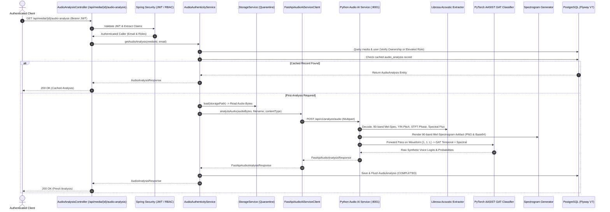

# Module 07: Audio Authenticity & Voice Forensics

This document details the architectural design, acoustic feature extraction algorithms, PyTorch AASIST spectro-temporal graph attention network, Flyway database schema, Spring Boot integration, and REST API specifications for **Module 07: Audio Authenticity & Voice Forensics** in TruthLens.

---

## 1. Executive Summary & Module Identity

- **Module ID**: Module 07
- **Module Name**: Audio Authenticity & Voice Forensics
- **Category**: AI Audio Forensics
- **Authoritative Blueprint Reference**:
  - Section C: Module 07 (`Detects synthetic speech generation, neural voice cloning (ElevenLabs/Bark), audio splicing boundaries, Mel-spectrogram frequency anomalies, phase discontinuities, and acoustic pitch variance.`)
  - Section D: Architecture Flow (`Audio Track -> Librosa Spectrogram Extractor -> PyTorch AASIST Classifier -> Mel-Spectrogram Image + Voice Cloning Probability`)
  - Section F: Data Architecture (`audio_analysis` table: `synthetic_voice_prob`, `spectrogram_url`, `pitch_variance`)
  - Section G: REST Routes (`/api/media/{id}/audio-analysis`)
  - Section H: Security Architecture (IDOR Protection, Quarantined Audio Storage, Role Authorization)
- **Primary Personas**: `ANALYST`, `INVESTIGATOR`, `MODERATOR`, `USER`, `ADMIN`, `RESEARCHER`
- **Downstream Integrations**:
  - Module 08: Audio-Video Synchronization Analysis (AV Sync)
  - Module 10: Speech-to-Text & Transcript Forensics (STT)
  - Module 15: Cross-Modal Risk Engine (consumes `synthetic_voice_prob` and acoustic evidence)
  - Module 19: Asynchronous Processing Queue

---

## 2. Implementation Summary

| Component | Status | Implementation Details |
| :--- | :--- | :--- |
| **Python FastAPI Microservice** | **Implemented** | Microservice located at `ai-ml/` exposing `POST /api/v1/analyze/audio`. Validates audio MIME types, enforces 50MB file size limit, and manages memory-safe audio processing. |
| **Librosa Acoustic Feature Extractor** | **Implemented** | `LibrosaAcousticExtractor` extracts 80-band log Mel-spectrograms, fundamental frequency ($F_0$) trajectory and pitch variance via the YIN algorithm, STFT phase derivative discontinuity, spectral shape statistics (centroid, bandwidth, rolloff, zero-crossing rate), and onset spectral flux splice detection. |
| **Mel-Spectrogram Image Generator** | **Implemented** | `SpectrogramGenerator` normalizes 80-band Mel-spectrogram power arrays into decibel space, renders orientation-corrected VIRIDIS heatmaps, persists PNG forensic artifacts to storage, and generates Base64 data strings for inline client rendering. |
| **PyTorch AASIST Neural Classifier** | **Implemented** | Genuine `AASISTClassifierNet` implementing Audio Anti-Spoofing using Integrated Spectro-Temporal Graph Attention Networks: 1D convolutional front-end, Temporal GAT, Spectral GAT, maximum/mean readout pooling, and classification head. Seeded deterministically with seed 42 (`0.1.0-dev`) with production checkpoint loading support (`1.0.0-prod`). |
| **Spring Boot Client & Orchestrator** | **Implemented** | `FastApiAudioAiServiceClient` using Spring `RestClient` with configurable 60-second timeouts. `AudioAuthenticityService` enforces IDOR authorization, `MediaType.AUDIO` validation, and idempotent database caching. |
| **PostgreSQL Schema (Flyway V7)** | **Implemented** | Migration `V7__create_audio_analysis_schema.sql` establishes `audio_analysis` table with check constraints (`0.0 <= synthetic_voice_prob <= 1.0`), unique constraint on `media_id`, foreign key with `ON DELETE CASCADE`, and B-Tree indexes. |
| **REST APIs** | **Implemented** | `GET /api/media/{id}/audio-analysis`, `POST /api/media/{id}/audio-analysis`, `GET /api/media/{id}/audio-analysis/evidence`, and `GET /api/media/{id}/audio-analysis/splice-markers`. |

---

## 3. Architecture & Data Flow



---

## 4. Acoustic Forensic Methodology

### 4.1 Log Mel-Spectrogram Extraction
- 80 Mel frequency filter banks spanning $[0, f_s / 2]$ with $f_s = 16{,}000\text{ Hz}$.
- Computed using STFT window size $N_{\text{fft}} = 1024$ and hop length $H = 512$ ($\approx 32\text{ ms}$ frame step).
- Scaled to logarithmic decibel power:
  $$\text{Mel}_{\text{dB}} = 10 \cdot \log_{10}\left(\frac{\text{Mel}(y)}{\max(\text{Mel}(y)) + \epsilon}\right)$$

### 4.2 Fundamental Frequency ($F_0$) & Pitch Variance via YIN
- Implemented using the YIN algorithm (`librosa.yin`) operating within human vocal limits ($[50\text{ Hz}, 500\text{ Hz}]$).
- Unvoiced and silent frames are filtered out to prevent numerical divergence.
- Natural human speech exhibits rich micro-prosody (pitch variance typically $100\text{ Hz}^2$ to $2500\text{ Hz}^2$).
- Monotone neural TTS exhibits unnaturally flat pitch trajectories ($\text{Var}(F_0) < 35\text{ Hz}^2$), while vocoder phase errors produce erratic spikes ($\text{Var}(F_0) > 3500\text{ Hz}^2$).

### 4.3 STFT Phase Discontinuity Metric
- Evaluates second-order phase acceleration across consecutive time frames:
  $$\Delta^2 \phi_{f, t} = \phi_{f, t+1} - 2\phi_{f, t} + \phi_{f, t-1}$$
- Normalized into a bounded coherence anomaly score $\in [0.0, 1.0]$. High phase acceleration indicates vocoder resynthesis artifacts or cut-and-splice boundaries.

### 4.4 Splice Boundary Detection via Spectral Flux
- Computes onset envelope spectral flux between adjacent STFT frames.
- Identifies peak onset transients that exceed dynamic statistical thresholds ($q_{0.96} + 0.5\sigma$).
- Marks splice anomalies with timestamps, confidence scores, and forensic rationale codes (`SPECTRAL_FLUX_JUMP`, `ACOUSTIC_ENERGY_TRANSITION`).

---

## 5. PyTorch AASIST Model Architecture

The deep neural classifier implements the **AASIST** (Audio Anti-Spoofing using Integrated Spectro-Temporal Graph Attention Networks) architecture:
1. **Front-End Feature Extractor**: 3-stage 1D convolutional network with batch normalization, LeakyReLU activations, and max-pooling operating directly on the raw mono waveform.
2. **Temporal Graph Attention Network (Temporal-GAT)**: Models long-range temporal dependencies across sequential speech frames.
3. **Spectral Graph Attention Network (Spectral-GAT)**: Projects features across frequency channels to model inter-harmonic acoustic correlations.
4. **Graph Readout Pooling**: Combines maximum pooling and mean pooling across both graphs into a composite $4 \times D$ representation.
5. **Classification Head**: Multi-layer perceptron with dropout ($0.3$ and $0.2$) outputting logits for bonafide vs. spoofed/synthetic speech.

---

## 6. Database Schema (Flyway V7)

Table: `audio_analysis`
```sql
CREATE TABLE audio_analysis (
    id                         UUID             NOT NULL,
    media_id                   UUID             NOT NULL,
    synthetic_voice_prob       DOUBLE PRECISION NOT NULL,
    spectrogram_url            VARCHAR(1024),
    pitch_variance             DOUBLE PRECISION NOT NULL DEFAULT 0.0,
    phase_discontinuity        DOUBLE PRECISION NOT NULL DEFAULT 0.0,
    splice_markers_json        TEXT,
    evidence_json              TEXT,
    analysis_status            VARCHAR(30)      NOT NULL DEFAULT 'COMPLETED',
    model_name                 VARCHAR(100),
    model_version              VARCHAR(100),
    created_at                 TIMESTAMPTZ      NOT NULL,
    updated_at                 TIMESTAMPTZ      NOT NULL,

    CONSTRAINT pk_audio_analysis PRIMARY KEY (id),
    CONSTRAINT uq_audio_analysis_media_id UNIQUE (media_id),
    CONSTRAINT fk_audio_analysis_media FOREIGN KEY (media_id) REFERENCES media (id) ON DELETE CASCADE,
    CONSTRAINT ck_audio_analysis_synthetic_voice_prob CHECK (synthetic_voice_prob >= 0.0 AND synthetic_voice_prob <= 1.0)
);

CREATE INDEX idx_audio_analysis_media_id             ON audio_analysis (media_id);
CREATE INDEX idx_audio_analysis_status               ON audio_analysis (analysis_status);
CREATE INDEX idx_audio_analysis_synthetic_voice_prob ON audio_analysis (synthetic_voice_prob);
```
