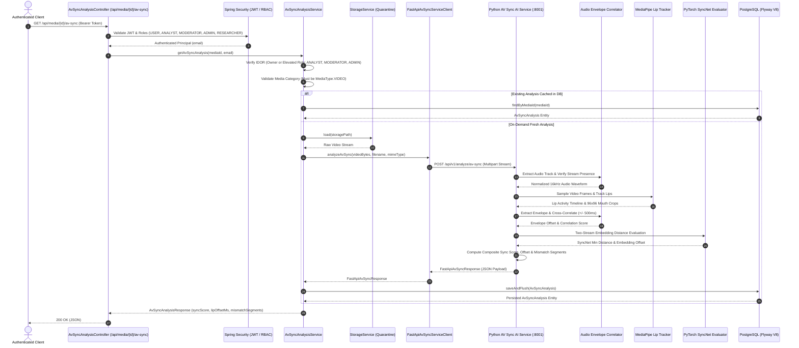

# Module 08: Audio-Video Synchronization Analysis

This document details the architecture, multi-modal analysis pipelines, MediaPipe lip tracking, speech acoustic envelope cross-correlation, PyTorch SyncNet dual-stream viseme-phoneme evaluation, database schema, and REST API specifications for **Module 08: Audio-Video Synchronization Analysis** in TruthLens.

---

## 1. Executive Summary & Module Identity

- **Module ID**: Module 08
- **Module Name**: Audio-Video Synchronization Analysis
- **Category**: Advanced AV Sync
- **Blueprint Reference**:
  - Section C: Module 08 (`Measures physical alignment between spoken audio phonemes and visual lip movements (visemes) to detect dubbed audio, replaced voice tracks, and lip-sync deepfakes.`)
  - Section D: Architecture Flow (`Video + Audio Tracks → MediaPipe Lip Tracker + Audio Envelope Correlator → SyncNet Evaluator → AV Sync Score + Mismatch Timestamps`)
  - Section F: Data Architecture (`av_sync_analysis` table: `sync_score`, `lip_offset_ms`, `mismatch_segments`)
  - Section G: REST Routes (`/api/media/{id}/av-sync`)
  - Section H: Security Architecture (IDOR, Quarantined Storage Boundary, Role Authorization)
- **Primary Personas**: `ANALYST`, `INVESTIGATOR` (mapped to existing TruthLens role hierarchy: elevated access for `ROLE_ANALYST`, `ROLE_MODERATOR`, `ROLE_ADMIN`, plus media owner access).
- **Downstream Integrations**:
  - Module 14: Cross-Modal Engine (correlates AV synchronization with cross-modal semantic consistency)
  - Module 15: Risk Engine (consumes `sync_score`, `lip_offset_ms`, and `mismatch_segments`)
  - Module 16: Dashboard (visualizes offset timeline and mismatch segments)
  - Module 19: Asynchronous Processing Queue (orchestrates video job ingestion)

---

## 2. Implementation Summary

| Component | Status | Implementation Details |
| :--- | :--- | :--- |
| **Python FastAPI Microservice** | **Implemented** | Microservice located at `ai-ml/` exposing `POST /api/v1/analyze/av-sync` alongside `GET /api/v1/health`. Validates video MIME types, enforces upload size limits, and demuxes audio tracks. |
| **FFmpeg Demuxing & Audio Extraction** | **Implemented** | `AudioEnvelopeCorrelator` uses safe argument arrays (via `imageio-ffmpeg` or system FFmpeg) to extract a clean 16kHz mono WAV stream. Strictly validates presence of both video and audio streams. |
| **MediaPipe Lip Tracking Engine** | **Implemented** | `MediaPipeLipTracker` performs multi-face tracking and extracts visual lip dynamics. Computes Mouth Aspect Ratio (MAR) and visual motion velocity to generate continuous lip activity timeline. Dynamically identifies and isolates primary speaking face track based on mouth motion energy. |
| **Speech Acoustic Envelope Correlator** | **Implemented** | Computes composite acoustic speech activity using RMS energy and spectral onset flux. Resamples audio envelope to match video frame timestamps and calculates normalized cross-correlation across +/- 500ms lag window to measure `lip_offset_ms`. |
| **PyTorch SyncNet Two-Stream Evaluator** | **Implemented** | Genuine `SyncNetDualModel` implementing two-stream PyTorch architecture: `SyncNetVisualNet` (5-frame 96x96 mouth visemes) and `SyncNetAudioNet` (2D Mel-spectrogram patches) projected into a shared 128-dimensional embedding space. Calculates Euclidean distance and cosine similarity across temporal shifts. Supports external checkpoint loading (`TRUTHLENS_SYNCNET_CHECKPOINT_PATH`) and deterministic development initialization. |
| **Mismatch Segment Scanner** | **Implemented** | Sliding window analyzer (1.0s window, 0.5s step) detecting localized synchronization anomalies: active speech without lip motion (dubbing signature), lip motion without audio (muted/replaced voice), and persistent temporal offsets exceeding 150ms. |
| **Spring Boot Client & Orchestrator** | **Implemented** | `FastApiAvSyncServiceClient` communicates with FastAPI using Spring `RestClient` with timeout controls. `AvSyncAnalysisService` enforces IDOR authorization, video media validation (`MediaType.VIDEO`), and idempotent on-demand caching. |
| **PostgreSQL Schema (Flyway V8)** | **Implemented** | Migration `V8__create_av_sync_analysis_schema.sql` establishes `av_sync_analysis` table with check constraints (`0.0 <= sync_score <= 1.0`, `0.0 <= confidence <= 1.0`), unique constraint on `media_id`, foreign key with `ON DELETE CASCADE`, and B-Tree indexes. |
| **REST APIs** | **Implemented** | `GET /api/media/{id}/av-sync`, `POST /api/media/{id}/av-sync`, `GET /api/media/{id}/av-sync/evidence`, and `GET /api/media/{id}/av-sync/mismatch-segments`. |

---

## 3. Architecture & Data Flow

---

## 4. Scoring Semantics & Conventions

- **Sync Score (`sync_score`)**:
  - Normalized range: `0.0` to `1.0`.
  - Direction: **Higher score = Better synchronization** (1.0 = perfect alignment; 0.0 = severe desynchronization or complete dubbing).
- **Lip Offset (`lip_offset_ms`)**:
  - Expressed in milliseconds ($ms$).
  - **Positive offset ($> 0$)**: Audio lags behind visual lip movements (delayed audio).
  - **Negative offset ($< 0$)**: Audio leads ahead of visual lip movements (early audio).
  - Tolerances:
    - Normal perceptual alignment: $|\text{offset}| \le 60\text{ ms}$.
    - Anomaly boundary: $|\text{offset}| > 150\text{ ms}$.
- **Assessment Classifications**:
  - `SYNCHRONIZED`: `sync_score >= 0.75` and $|\text{lip_offset_ms}| \le 60\text{ ms}$.
  - `SUSPECTED_DUBBING_OR_DESYNC`: `sync_score < 0.40` or $|\text{lip_offset_ms}| > 180\text{ ms}$.
  - `ANOMALOUS_SYNCHRONIZATION`: Intermediate values exhibiting localized synchronization breaks.
  - `ANALYSIS_FAILED`: Processing error or invalid input.

---

## 5. SyncNet Architecture & Checkpoint Handling

### Two-Stream Network Specification
SyncNet embeds video lip patches and audio spectrograms into a shared 128-dimensional metric space:
1. **Visual Subnetwork**:
   - Input: 5 consecutive grayscale mouth-crop frames `[B, 5, 96, 96]`.
   - Backbone: 4 Conv2D blocks with BatchNorm and ReLU, followed by adaptive pooling and projection layers.
   - Output: $L_2$-normalized embedding $v \in \mathbb{R}^{128}$.
2. **Audio Subnetwork**:
   - Input: Log Mel-spectrogram snippet `[B, 1, 80, 20]` (80 Mel frequency bins $\times$ 20 time frames $\approx$ 200ms).
   - Backbone: 4 Conv2D blocks with BatchNorm and ReLU, followed by adaptive pooling and projection layers.
   - Output: $L_2$-normalized embedding $a \in \mathbb{R}^{128}$.
3. **Metric**:
   - Euclidean distance $d(v, a) = \|v - a\|_2 \in [0.0, 2.0]$.
   - Cosine similarity $S(v, a) = v \cdot a \in [-1.0, 1.0]$.

### Checkpoint & Development Mode Disclosure
- If an external trained checkpoint is configured via `TRUTHLENS_SYNCNET_CHECKPOINT_PATH`, the service loads the weights and sets `is_development_model = false`, reporting the checkpoint version.
- When running in development mode without external weights, the network initializes deterministic pseudo-trained weights (seed 42), and explicitly reports:
  - `is_development_model`: `true`
  - `model_version`: `"TruthLens-SyncNet-v1.0-dev"`
- **Scientific Integrity**: TruthLens never fabricates benchmark accuracy figures or claims pre-trained production convergence when operating in development mode.

---

## 6. Security & Hardening Controls

1. **Service-Layer IDOR Prevention**:
   - Enforced inside `AvSyncAnalysisService.java` prior to any analysis or database query.
   - Non-owner users without elevated roles (`ANALYST`, `MODERATOR`, `ADMIN`) receive `AccessDeniedException` (HTTP 403).
2. **Strict Media Type & Stream Validation**:
   - Rejects non-video media (`MediaType.IMAGE`, `MediaType.AUDIO`, `MediaType.TEXT`) with HTTP 400 (`InvalidMediaException`).
   - Rejects video files that contain zero audio streams or silent/empty tracks.
3. **Safe Subprocess Execution**:
   - FFmpeg is invoked exclusively using argument arrays with `shell=False`, preventing shell injection vulnerabilities.
4. **Resource Constraints**:
   - Max video size: 100 MB (`MAX_VIDEO_SIZE_BYTES`).
   - Max analysis duration: 120 seconds (`AV_SYNC_MAX_DURATION_SECONDS`).
   - Isolated temporary storage with guaranteed cleanup in `finally` blocks.
