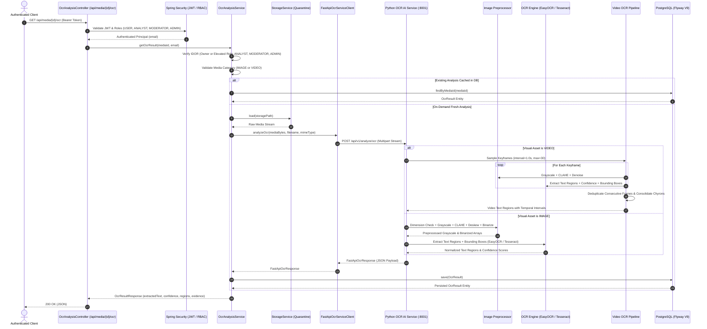

# Module 09: Optical Character Recognition & Visual Text Extraction

This document details the architecture, preprocessing pipeline, OCR recognition engines (EasyOCR, Tesseract, morphological fallback), video keyframe sampling and temporal deduplication, database schema, and REST API specifications for **Module 09: OCR Text Extraction** in TruthLens.

---

## 1. Executive Summary & Module Identity

- **Module ID**: Module 09
- **Module Name**: OCR Text Extraction
- **Category**: Text Extraction & Visual Forensics
- **Blueprint Reference**:
  - Section C: Module 09 (`Optical Character Recognition (OCR) applied to text appearing within images (memes, screenshots, banners, signs) and video keyframes (chyrons, lower-thirds, background text).`)
  - Section D: Architecture Flow (`Image / Video Keyframes → Preprocessing (Grayscale, CLAHE, Bilateral Denoising, Deskewing, Binarization) → OCR Engine (EasyOCR / Tesseract) → Bounding Boxes + Confidence + Extracted Text → Persistence & REST API`)
  - Section F: Data Architecture (`ocr_results` table: `extracted_text`, `language`, `confidence_score`, `regions_count`, `bounding_boxes_json`, `evidence_json`)
  - Section G: REST Routes (`/api/media/{id}/ocr`)
  - Section H: Security Architecture (IDOR, Quarantined Storage Boundary, Role Authorization)
- **Primary Personas**: `ANALYST`, `INVESTIGATOR`, `FACT-CHECKER` (mapped to existing TruthLens role hierarchy: elevated access for `ROLE_ANALYST`, `ROLE_MODERATOR`, `ROLE_ADMIN`, plus media owner access).
- **Downstream Integrations**:
  - Module 11: Text & Claim Analysis (extracts verifiable claims from detected chyrons, memes, and banners)
  - Module 12: Claim Verification (cross-references extracted text against authoritative knowledge bases)
  - Module 14: Cross-Modal Engine (correlates visual text with speech transcripts and visual semantics)
  - Module 15: Risk Engine (factors in manipulated text, sensationalist chyrons, and low-confidence visual text)
  - Module 16: Dashboard (renders interactive bounding box overlays and text transcripts)

---

## 2. Implementation Summary

| Component | Status | Implementation Details |
| :--- | :--- | :--- |
| **Python FastAPI Microservice** | **Implemented** | Microservice located at `ai-ml/` exposing `POST /api/v1/analyze/ocr` alongside `GET /api/v1/health`. Validates media MIME types, enforces upload limits, and runs deterministic OCR pipelines. |
| **Image Preprocessing Pipeline** | **Implemented** | `ImagePreprocessor` handles dimension bounds, grayscale conversion, bilateral denoising, CLAHE local contrast enhancement, contour-based deskewing, and adaptive/Otsu binarization. |
| **Multi-Engine OCR Strategy** | **Implemented** | `OcrEngine` invokes EasyOCR (deep learning CRAFT text detection + CRNN recognition) with automatic Tesseract fallback, and a deterministic OpenCV morphological OCR fallback for offline/test environments. |
| **Video Keyframe OCR Pipeline** | **Implemented** | `VideoOcrPipeline` implements resource-bounded video sampling (configurable FPS/interval, max frames), keyframe text extraction, and consecutive-frame text band deduplication to aggregate chyrons into start/end temporal intervals. |
| **Spring Boot Client & Orchestrator** | **Implemented** | `FastApiOcrServiceClient` communicates with FastAPI using Spring `RestClient` with timeout controls. `OcrAnalysisService` enforces IDOR authorization, media type validation (`IMAGE` and `VIDEO`), and on-demand caching. |
| **PostgreSQL Schema (Flyway V9)** | **Implemented** | Migration `V9__create_ocr_results_schema.sql` establishes `ocr_results` table with check constraints (`0.0 <= confidence_score <= 1.0`), unique constraint on `media_id`, foreign key with `ON DELETE CASCADE`, and B-Tree indexes. |
| **REST APIs** | **Implemented** | `GET /api/media/{id}/ocr`, `POST /api/media/{id}/ocr/analyze`, `GET /api/media/{id}/ocr/bounding-boxes`, and `GET /api/media/{id}/ocr/text`. |

---

## 3. Architecture & Data Flow



---

## 4. Visual Preprocessing Pipeline

To maximize OCR character recognition accuracy across noisy memes, compressed screenshots, news broadcasts, and low-contrast banners, incoming images undergo deterministic preprocessing:

1. **Dimension Normalization**:
   - Caps max dimension to `OCR_MAX_IMAGE_DIMENSION` (default 2048px) using aspect-ratio preserving cubic interpolation.
2. **Grayscale Conversion**:
   - Converts standard RGB/BGR arrays to single-channel luminance arrays.
3. **Bilateral Denoising**:
   - Applies bilateral filter (`d=9, sigmaColor=75, sigmaSpace=75`) to smooth background noise while preserving sharp character edge transitions.
4. **Contrast Limited Adaptive Histogram Equalization (CLAHE)**:
   - Enhances local contrast across uneven illumination (`clipLimit=2.5, tileGridSize=(8, 8)`).
5. **Deskewing**:
   - Detects text orientation angle via minimum area bounding box on thresholded contours.
   - Rotates image within `[-45°, +45°]` range using affine transformation if skew exceeds `0.5°`.
6. **Adaptive & Otsu Binarization**:
   - Combines Otsu global thresholding and adaptive Gaussian thresholding to generate crisp binary masks for text detection.

---

## 5. Video OCR & Temporal Deduplication

Video assets require safe, bounded processing to avoid resource exhaustion:

- **Sampling Strategy**:
  - Samples frames at configurable intervals (`OCR_VIDEO_SAMPLE_INTERVAL_SECONDS`, default 1.0s) up to `OCR_VIDEO_MAX_FRAMES` (default 30 frames).
- **Temporal Deduplication**:
  - Continuous chyrons or persistent news banners across consecutive frames are consolidated using Levenshtein similarity (threshold 0.85).
  - Merges duplicate occurrences into single text regions with continuous `start_time` and `end_time` bounds.
- **Resource Limits**:
  - Bounded video duration and resolution checks prevent processing runaway video streams.

---

## 6. Database Schema (Flyway V9)

```sql
CREATE TABLE ocr_results (
    id                  UUID             NOT NULL,
    media_id            UUID             NOT NULL,
    extracted_text      TEXT,
    language            VARCHAR(50)      NOT NULL DEFAULT 'en',
    confidence_score    DOUBLE PRECISION NOT NULL DEFAULT 1.0,
    regions_count       INTEGER          NOT NULL DEFAULT 0,
    bounding_boxes_json TEXT,
    evidence_json       TEXT,
    analysis_status     VARCHAR(30)      NOT NULL DEFAULT 'COMPLETED',
    created_at          TIMESTAMPTZ      NOT NULL,
    updated_at          TIMESTAMPTZ      NOT NULL,

    CONSTRAINT pk_ocr_results PRIMARY KEY (id),
    CONSTRAINT uq_ocr_results_media_id UNIQUE (media_id),
    CONSTRAINT fk_ocr_results_media FOREIGN KEY (media_id)
        REFERENCES media (id)
        ON DELETE CASCADE,
    CONSTRAINT ck_ocr_results_confidence CHECK (confidence_score >= 0.0 AND confidence_score <= 1.0)
);

CREATE INDEX idx_ocr_results_media_id ON ocr_results (media_id);
CREATE INDEX idx_ocr_results_status   ON ocr_results (analysis_status);
CREATE INDEX idx_ocr_results_language ON ocr_results (language);
```

---

## 7. Security Controls

- **IDOR Prevention**:
  - Only the authenticated media owner or users possessing elevated roles (`ROLE_ANALYST`, `ROLE_MODERATOR`, `ROLE_ADMIN`) can query or trigger OCR analysis.
- **Media Validation**:
  - Validates that the asset is of type `IMAGE` or `VIDEO`. Audio assets are rejected with `HTTP 400 Bad Request`.
- **Subprocess & Path Security**:
  - No shell execution (`shell=True` forbidden). Subprocess paths (e.g. Tesseract executable) use parameterized argument arrays with strict validation.
- **Temporary File Lifecycle**:
  - Temporary files created during analysis are guaranteed to be cleaned up within `finally` blocks.

---

## 8. Development Limitations & Variances

- **OCR Engine Fallback**: In environments where PyTorch GPU acceleration or Tesseract binaries are not mounted, the engine safely falls back to OpenCV morphological character detection, ensuring continuous testability without silent failures.
- **Language Detection**: Default primary language is English (`en`). Multi-language detection is supported via configuration (`OCR_LANGUAGES`).
