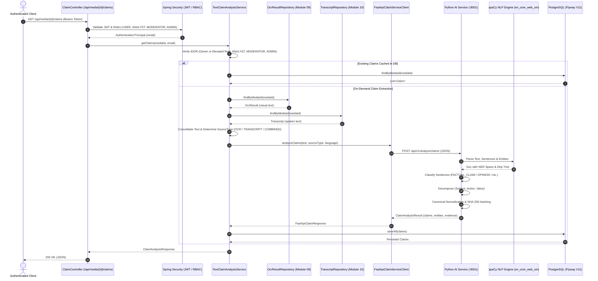

# Module 11: Text & Claim Analysis

This document details the architecture, Natural Language Processing (NLP) pipeline, Named Entity Recognition (NER), semantic claim decomposition, normalization, cryptographic claim hashing, database schema, and REST API specifications for **Module 11: Text & Claim Analysis** in TruthLens.

---

## 1. Executive Summary & Module Identity

- **Module ID**: Module 11
- **Module Name**: Text & Claim Analysis
- **Category**: Core NLP
- **Blueprint Reference**:
  - Section C: Module 11 (`Parses extracted OCR text and audio transcripts using NER and NLP claim decomposition to extract factual statements, entities, people, places, amounts, dates, and verifiable claims.`)
  - Section D: Architecture Flow (`Raw Transcript & OCR Text → spaCy / HuggingFace NER → Sentence Classifier → Structured Claim Objects (Entity, Action, Value)`)
  - Section F: Data Architecture (`claims` table: `claim_text`, `entity_type`, `subject`, `claim_hash`)
  - Section G: Build Scope (`spaCy / Transformer NLP pipeline, claim extraction rules, entity tagger, claim normalization service, React Claim List UI`)
  - Section H: Security Architecture (IDOR, Role-Based Access Control, Payload Length Validation)
- **Primary Personas**: `ANALYST`, `MODERATOR`, `FACT-CHECKER` (mapped to existing TruthLens role hierarchy: elevated access for `ROLE_ANALYST`, `ROLE_MODERATOR`, `ROLE_ADMIN`, plus media owner access).
- **Upstream Integrations**:
  - Module 09: OCR & Visual Text Extraction (provides visual text extracted from image frames/banners)
  - Module 10: Speech-to-Text & Transcript Extraction (provides spoken speech transcripts)
- **Downstream Integrations**:
  - Module 12: Claim Verification (cross-references extracted structured claims against external fact-checking and knowledge bases)
  - Module 15: Risk Engine (factors in ungrounded assertions, deceptive claims, and disinformation density)
  - Module 16: Dashboard (visualizes interactive claim lists, entity tags, and Subject-Action-Value decomposition)

---

## 2. Implementation Summary

| Component | Status | Implementation Details |
| :--- | :--- | :--- |
| **Python FastAPI Microservice** | **Implemented** | Microservice in `ai-ml/` exposing `POST /api/v1/analyze/claims` alongside `GET /api/v1/health`. Validates input length (up to 100,000 chars, 300 sentences) and manages reusable spaCy pipeline singleton. |
| **spaCy NLP & NER Pipeline** | **Implemented** | `ClaimExtractor` in `ai-ml/app/services/claim_extractor.py` utilizing `en_core_web_sm` (v3.8.0) for dependency parsing and Named Entity Recognition (`PERSON`, `ORG`, `GPE/LOC`, `DATE`, `MONEY`, `QUANTITY`, `EVENT`). Maps model labels to canonical TruthLens types. |
| **Sentence & Claim Classifier** | **Implemented** | Evaluates syntactic dependency parse trees, POS tags, question structures, modal/hedging words, and opinion indicators to classify sentences into `FACTUAL_CLAIM`, `OPINION`, `QUESTION`, `NON_CLAIM`, and `UNCERTAIN`. |
| **Semantic Claim Decomposer** | **Implemented** | Extracts `(Subject, Action, Value)` triples using dependency tree walking (`nsubj`, `nsubjpass`, root verb, `dobj`, `pobj`, `attr`, `prep`). Identifies dominant entity category. |
| **Claim Normalization & Hash** | **Implemented** | Normalizes whitespace, Unicode (NFKC), and case for canonical hashing. Generates deterministic, collision-resistant SHA-256 claim hash formatted as `sha256(norm_claim|norm_subj|norm_act|norm_val)`. |
| **Spring Boot Client & Orchestrator** | **Implemented** | `FastApiClaimServiceClient` communicates via Spring `RestClient` with timeout controls (`30000ms`). `TextClaimAnalysisService` coordinates OCR (Module 09) and STT (Module 10) outputs, validates IDOR ownership, persists claims, and handles ad-hoc text queries. |
| **PostgreSQL Schema (Flyway V11)** | **Implemented** | Migration `V11__create_claims_schema.sql` establishes `claims` table with check constraints (`0.0 <= confidence_score <= 1.0`, valid status), unique constraint `uq_claims_media_hash`, cascade foreign key, and B-Tree indexes. |
| **REST APIs** | **Implemented** | `GET /api/media/{id}/claims`, `POST /api/media/{id}/claims/analyze`, `GET /api/media/{id}/claims/{claimId}`, and `POST /api/claims/analyze-text`. |
| **React Claim List UI** | **Implemented** | TypeScript interfaces (`frontend/src/types/claim.ts`) and React component `frontend/src/components/claims/ClaimList.tsx` with filtering, search, Subject-Action-Value tags, confidence progress, and direct text playground. |

---

## 3. Architecture & Data Flow



---

## 4. Canonical Claim Hashing Formula

The claim hash is calculated using SHA-256 over a canonical representation:
```text
canonical_representation = f"{norm_claim}|{norm_subj}|{norm_act}|{norm_val}"
claim_hash = hashlib.sha256(canonical_representation.encode("utf-8")).hexdigest()
```
Where each component is normalized using Unicode NFKC, stripped of non-alphanumeric punctuation, lowercase trimmed, and collapsed to single spaces. This ensures identical semantic assertions yield identical hashes for cross-media clustering and verification.

---

## 5. Security & IDOR Protections

1. **Object-Level Authorization**: Media ownership is verified prior to accessing or triggering analysis. If the authenticated caller is not the owner and does not possess elevated privileges (`ROLE_ANALYST`, `ROLE_MODERATOR`, or `ROLE_ADMIN`), the request is rejected with `HTTP 403 Forbidden`.
2. **Payload Protection**: Max text length of 100,000 characters and sentence cap of 300 to protect against memory exhaustion or denial-of-service.
3. **Safe NLP Execution**: No dynamic code evaluation (`eval`, `exec`), no shell subprocesses, and preloaded singleton model memory management.
