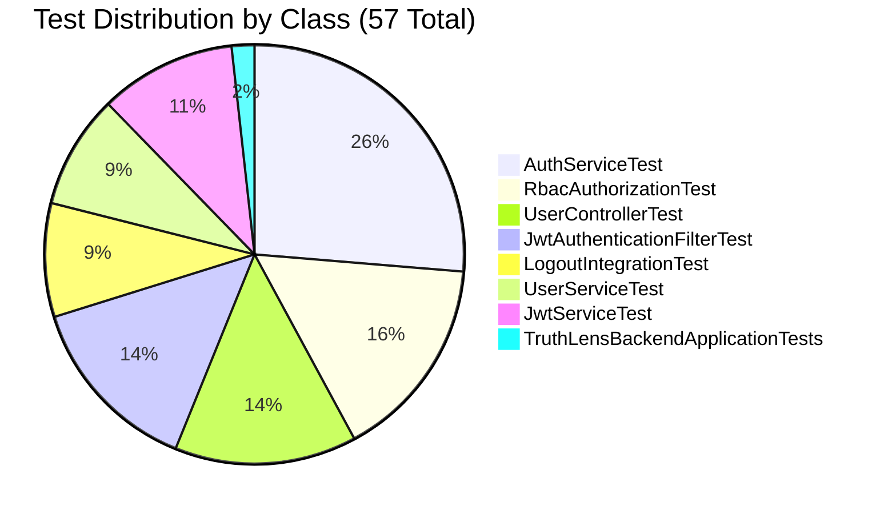

# Testing Strategy & Test Suite

This document describes the multi-tiered testing strategy and current test suite for the **TruthLens Backend Service**.

---

## 1. Testing Philosophy

TruthLens employs a multi-tiered testing approach adhering to the testing pyramid:
1. **Unit Tests (Fast, Isolated)**: Validate domain logic, cryptographic token manipulation, exception handling, and service orchestration without booting the Spring container.
2. **Web Slice Tests (`@WebMvcTest`)**: Validate HTTP routing, request deserialization, Jakarta validation constraints, status codes, and error mapping with mocked service beans.
3. **Security & Integration Tests (`@SpringBootTest` + `MockMvc`)**: Validate Spring Security filter chains, JWT token extraction, method-level RBAC (`@PreAuthorize`), and token revocation persistence.

---

## 2. Test Configuration (`application-test.properties`)

Automated tests run against [application-test.properties](file:///c:/Users/Yashas%20H%20L/IdeaProjects/TruthLens/TruthLens-Authenticity-Platform/backend/src/test/resources/application-test.properties).
- **Test JWT Secret**: A dedicated 256-bit test key (`404E6352...`) is supplied for signing tokens during testing.
- **Short Expiration**: Configured with 1 hour (`3600000` ms) expiration to support lifecycle tests.

---

## 3. Test Suite Inventory (57 Tests)

The test suite contains **57 automated tests** across 8 test classes:



### 3.1 `com.truthlens.backend.service.AuthServiceTest` (15 tests)
- Tests user registration success with normalized email, BCrypt hashing, and `USER` role assignment.
- Tests duplicate registration rejection (`EmailAlreadyExistsException` / 409).
- Tests missing system role error (`RoleNotFoundException` / 500).
- Tests login authentication success and signed token generation.
- Tests invalid credential rejection on unknown email or bad password (generic 401).
- Tests suspended account login rejection (`AccountSuspendedException` / 403).
- Tests token revocation on logout, idempotency checks, and malformed token handling.

### 3.2 `com.truthlens.backend.service.UserServiceTest` (5 tests)
- Tests profile retrieval for existing user.
- Tests `UserNotFoundException` when email does not exist.
- Tests updating editable profile attributes (`fullName`).
- Tests that protected fields (`email`, `roles`, `status`, `id`) remain immutable during update.
- Tests null/empty update requests.

### 3.3 `com.truthlens.backend.security.JwtServiceTest` (6 tests)
- Tests token generation containing required claims (`sub`, `userId`, `roles`, `iat`, `exp`, `jti`).
- Tests validation of unexpired tokens signed with valid key.
- Tests rejection of tokens signed with a different key (signature failure).
- Tests rejection of expired tokens.
- Tests rejection of malformed or corrupted token strings.
- Tests extraction of claims and roles with `ROLE_` prefix.

### 3.4 `com.truthlens.backend.security.JwtAuthenticationFilterTest` (8 tests)
- Tests request passing through filter chain when no `Authorization` header is present.
- Tests rejection when `Authorization` header lacks `Bearer ` prefix.
- Tests rejection when token is revoked in `RevokedTokenRepository`.
- Tests rejection when token lacks a valid `jti` claim.
- Tests successful authentication context population for valid, unrevoked tokens.
- Tests that existing `SecurityContext` authentication is not overwritten.

### 3.5 `com.truthlens.backend.controller.UserControllerTest` (8 tests)
- Tests `GET /api/users/me` returns 200 with profile DTO for authenticated user.
- Tests `GET /api/users/me` returns 401 for unauthenticated request.
- Tests `PUT /api/users/me` returns 200 with updated profile.
- Tests `PUT /api/users/me` returns 400 when `fullName` exceeds 100 characters.
- Tests `PUT /api/users/me` returns 401 when called without a valid JWT.

### 3.6 `com.truthlens.backend.security.RbacAuthorizationTest` (9 tests)
- Tests `@PreAuthorize` method security across all 5 roles:
  - `ROLE_USER` access to `/api/rbac/user` (200 OK) vs `/api/rbac/admin` (403 Forbidden).
  - `ROLE_ANALYST` access to `/api/rbac/analyst` (200 OK) vs `/api/rbac/moderator` (403 Forbidden).
  - `ROLE_MODERATOR` access to `/api/rbac/moderator` (200 OK) vs `/api/rbac/admin` (403 Forbidden).
  - `ROLE_ADMIN` access to `/api/rbac/admin` (200 OK).
  - `ROLE_RESEARCHER` access to `/api/rbac/researcher` (200 OK) vs `/api/rbac/analyst` (403 Forbidden).
- Tests that unauthenticated calls to all RBAC endpoints return 401 Unauthorized.

### 3.7 `com.truthlens.backend.security.LogoutIntegrationTest` (5 tests)
- Tests end-to-end logout flow: logging in, invoking `POST /api/auth/logout`, verifying `revoked_tokens` row creation.
- Tests that a revoked token receives 401 Unauthorized on subsequent protected requests.
- Tests logout idempotency when invoked multiple times with the same token.
- Tests logout rejection for invalid or malformed tokens.

### 3.8 `com.truthlens.backend.TruthLensBackendApplicationTests` (1 test)
- Tests Spring Boot context load sanity check.

---

## 4. Running the Tests

Execute the full suite using Maven with Java 21:

```bash
cd backend
mvn test
```

### Expected Output Summary
```
[INFO] Results:
[INFO] 
[INFO] Tests run: 57, Failures: 0, Errors: 0, Skipped: 0
[INFO] 
[INFO] ------------------------------------------------------------------------
[INFO] BUILD SUCCESS
[INFO] ------------------------------------------------------------------------
```
